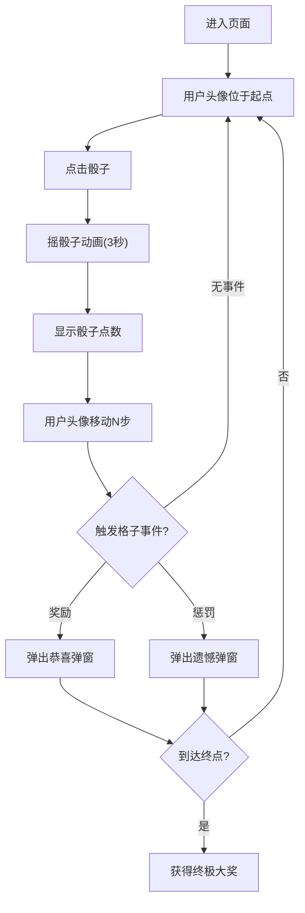

## 1. 产品概述

抽奖玩法H5运营页面，用户通过摇骰子走地图，每步随机触发奖励或惩罚，最终到达终点获得终极大奖。

- 目标用户：活动参与者，通过趣味互动获得虚拟奖励
- 核心价值：通过游戏化运营提升用户活跃度和参与度

## 2. 核心功能

### 2.1 功能模块
1. **首页（游戏主页）**：骰子区域、地图棋盘、用户信息展示
2. **骰子摇奖**：点击触发3秒摇骰子动画，包含音效和视觉效果
3. **地图行走**：8个目的地，每个目的地之间5步，共40步
4. **奖励/惩罚系统**：每步随机触发奖励或惩罚
5. **弹窗系统**：展示奖励/惩罚的图片和描述文案

### 2.2 页面详情
| 页面名称 | 模块名称 | 功能描述 |
|---------|---------|---------|
| 主页 | 骰子区域 | 点击骰子触发摇骰子动画，3秒后显示点数 |
| 主页 | 地图棋盘 | 展示40个格子，8个目的地节点，用户头像位置移动 |
| 主页 | 用户信息 | 显示用户头像、金币数量等 |
| 主页 | 奖励弹窗 | 展示奖励/惩罚图片和描述文案，奖励显示"恭喜你"，惩罚显示"很遗憾" |

## 3. 核心流程

1. 用户进入页面 → 看到初始位置的用户头像和骰子
2. 点击骰子 → 触发3秒摇骰子动画（音效+视觉效果）
3. 动画结束 → 显示骰子点数 → 用户头像移动对应步数
4. 到达格子 → 触发该格子的奖励或惩罚
5. 弹出弹窗 → 展示奖励/惩罚内容
6. 关闭弹窗 → 继续游戏或到达终点获得终极大奖

## 4. 用户界面设计

### 4.1 设计风格
- 主色调：金色/紫色系，营造豪华抽奖氛围
- 按钮样式：圆角3D按钮，带发光效果
- 字体：使用系统字体，标题加粗
- 布局：卡片式布局，地图居中展示
- 图标/emoji：使用🎲、🏆、💰、🎁等emoji

### 4.2 页面设计概述
| 页面名称 | 模块名称 | UI元素 |
|---------|---------|---------|
| 主页 | 骰子区域 | 3D骰子样式，摇动动画，发光效果 |
| 主页 | 地图棋盘 | 蛇形/环形布局，彩色格子，目的地节点突出显示 |
| 主页 | 用户头像 | 圆形头像，带发光边框，平滑移动动画 |
| 主页 | 奖励弹窗 | 居中弹窗，带背景模糊，图片+文字，动画进入 |

### 4.3 响应式设计
- 移动端优先设计
- 适配iPhone和安卓主流屏幕
- 触摸优化，按钮大小适合手指点击
