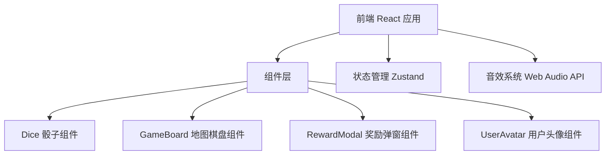

## 1. 架构设计



## 2. 技术说明
- 前端：React@18 + TypeScript + TailwindCSS + Vite
- 初始化工具：vite-init
- 状态管理：Zustand
- 动画：CSS Animation + Framer Motion
- 音效：Web Audio API（生成音效）
- 后端：无（纯前端H5页面）

## 3. 路由定义
| 路由 | 用途 |
|-----|------|
| / | 游戏主页，包含所有游戏功能 |

## 4. 数据模型

### 4.1 格子类型定义
```typescript
type CellType = 'start' | 'destination' | 'reward' | 'punishment' | 'normal' | 'end';

interface RewardItem {
  type: 'coins' | 'gift' | 'forward' | 'backward';
  value: number;
  name: string;
  icon: string;
  description: string;
}

interface Cell {
  id: number;
  type: CellType;
  reward?: RewardItem;
  isDestination: boolean;
  destinationName?: string;
}

interface GameState {
  currentPosition: number;
  isRolling: boolean;
  diceValue: number | null;
  showModal: boolean;
  currentReward: RewardItem | null;
  coins: number;
  hasFinished: boolean;
}
```

## 5. 游戏配置
- 总格子数：40（8个目的地，每两个目的地之间5步）
- 格子事件概率：
  - 奖励：40%
  - 惩罚：25%
  - 无事件：35%
- 奖励类型：
  - 前进1-3步
  - 金币10-100
  - 虚拟礼物
- 惩罚类型：
  - 后退1-2步
  - 扣除金币
