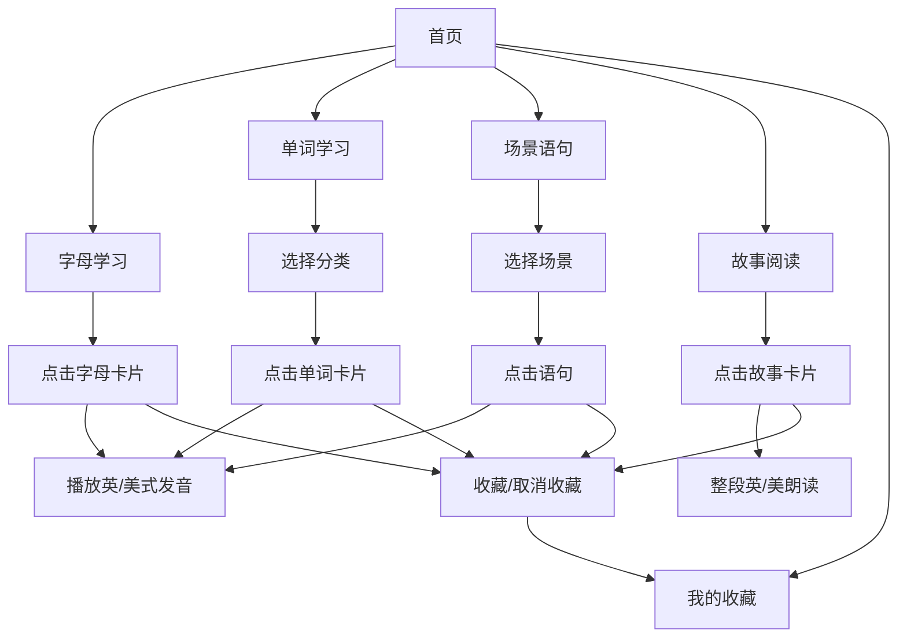

# 儿童早教英语学习 H5 — 产品需求文档 (PRD)

## 1. 产品概述
儿童早教英语学习 H5 是一款面向 3-10 岁儿童及家长的移动端网页应用，专注于英语启蒙教育。通过英/美双发音、图文结合、故事阅读与收藏复习等方式，让孩子在趣味与互动中学习基础英语。
- 目标用户：学龄前/低年级儿童及其家长
- 核心价值：提供标准、系统、分模块的英语学习内容，支持孩子自我探索与家长辅助
- 产品定位：轻量、纯前端、可离线使用的儿童英语启蒙 H5

## 2. 核心功能

### 2.1 用户角色
| 角色 | 注册方式 | 核心权限 |
|------|----------|----------|
| 家长/儿童 | 免注册（本地存储收藏） | 浏览所有学习内容、播放发音、收藏内容、管理收藏夹 |

### 2.2 功能模块
1. **首页**：品牌欢迎区 + 四大学习模块入口 + 我的收藏入口
2. **字母学习页**：26 个英文字母卡片，支持英式/美式发音切换播放
3. **单词学习页**：9 大分类（水果、蔬菜、动物、服饰、人体、称呼、感情、颜色、交通工具），每类 ≥ 20 个单词，带分类图标，支持英式/美式发音
4. **场景语句页**：5 大类场景（学校、家庭、见面、吃饭、道歉），每类若干常用语句，支持英式/美式发音
5. **故事阅读页**：多个简短儿童英语故事，每个故事带相关插画，支持英式/美式整段朗读
6. **我的收藏页**：汇总用户收藏的字母、单词、句子、故事，可取消收藏、可点击播放发音

### 2.3 页面详情
| 页面名称 | 模块名称 | 功能描述 |
|----------|----------|----------|
| 首页 | 欢迎 Hero | 品牌名、副标题、可爱背景装饰 |
| 首页 | 模块导航 | 4 个学习模块 + 1 个收藏入口卡片，带图标与描述 |
| 字母学习页 | 字母卡片网格 | A-Z 字母卡片，大字体展示，点击播放、点击切换英/美式，点击收藏 |
| 单词学习页 | 分类入口 | 9 个分类卡片（带分类图标） |
| 单词学习页 | 单词卡片列表 | 每类单词（≥20），展示中/英/音标，支持英/美播放与收藏 |
| 场景语句页 | 场景入口 | 5 个场景卡片 |
| 场景语句页 | 语句列表 | 展示场景下多条语句，逐条英/美发音，支持收藏 |
| 故事阅读页 | 故事列表 | 多个故事卡片，带插画缩略图 |
| 故事阅读页 | 故事阅读 | 单故事阅读页，显示插画 + 文本，整段朗读 |
| 我的收藏页 | 收藏分类 Tab | 字母/单词/句子/故事四个分类 Tab |
| 我的收藏页 | 收藏项列表 | 可播放、可取消收藏 |

## 3. 核心流程
用户进入首页 → 选择学习模块 → 浏览内容 → 点击播放英式/美式发音 → 点击收藏 → 在“我的收藏”中复习

## 4. 用户界面设计

### 4.1 设计风格
- **主色**：柔和的橙黄色 `#FFB547` 与天空蓝 `#4FC3F7`，辅色：薄荷绿 `#81C784`、粉紫 `#BA68C8`
- **按钮风格**：圆润、大圆角、带柔和阴影、点击有缩放反馈
- **字体**：展示字体使用圆润卡通感字体（如 "Comic Neue" / "Fredoka"），正文字体使用系统无衬线字体
- **布局风格**：卡片式、移动端优先、内容居中、留白充足
- **图标/表情**：使用 Emoji 作为分类与单词配图，童趣十足

### 4.2 页面设计概览
| 页面名称 | 模块名称 | UI 元素 |
|----------|----------|----------|
| 首页 | 欢迎 Hero | 大标题、卡通背景、渐变气泡动画 |
| 首页 | 模块导航 | 圆角卡片、Emoji 图标、颜色区分 |
| 字母学习页 | 字母网格 | 26 格卡片网格、大字母、收藏角标 |
| 单词学习页 | 分类入口 | 9 彩色分类卡片、Emoji 分类图标 |
| 单词学习页 | 单词列表 | 卡片列表、中文/英文/音标、播放按钮、收藏按钮 |
| 场景语句页 | 场景入口/语句列表 | 圆角卡片、图标、分条播放 |
| 故事阅读页 | 故事卡片 | 横向/竖向卡片、插画缩略图 |
| 故事阅读页 | 故事详情 | 顶部插画、正文段落、朗读按钮 |
| 我的收藏页 | 收藏列表 | Tab 切换、分类展示、取消收藏 |

### 4.3 响应式
移动端优先（H5），使用 Tailwind 响应式工具类，在 ≥ 768px 的平板/桌面上使用居中容器展示，触摸优化。

## 5. 发音实现
使用浏览器 Web Speech API（`SpeechSynthesis`），通过选择不同 `lang` 与 `voice`：
- 英式：`en-GB`
- 美式：`en-US`

优先使用系统安装的本地语音，若缺失则回退到系统默认语音。

## 6. 插画实现
故事插画使用在线图片服务生成或使用可商用的免费插画 URL（例如 picsum.photos 指定 seed，或使用内置 SVG 插画）。本版本使用 emoji 组合 + CSS 背景作为"插画"，保证离线可用。
