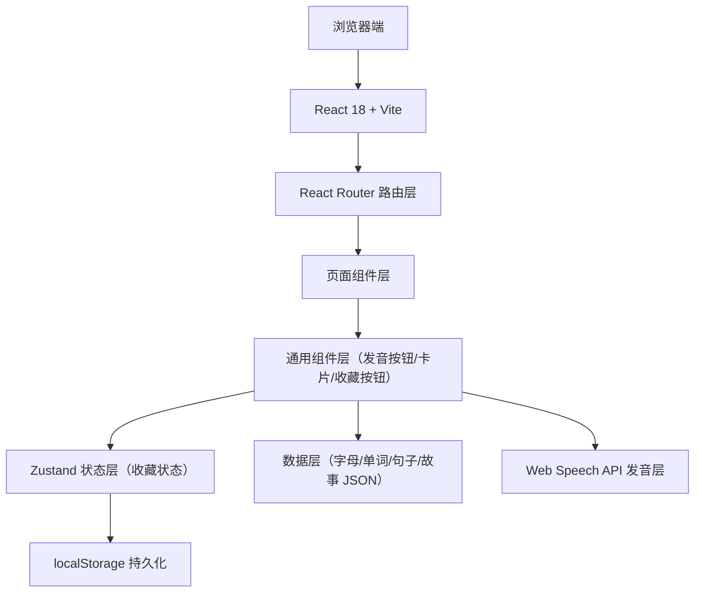
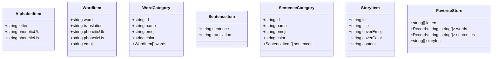

# 儿童早教英语学习 H5 — 技术架构文档

## 1. 架构设计
纯前端单页应用（SPA），无后端，数据以本地 JSON 管理，收藏以 localStorage 持久化。



## 2. 技术选型
- **前端框架**：React 18 + TypeScript
- **构建工具**：Vite
- **路由**：react-router-dom
- **样式**：Tailwind CSS 3
- **状态管理**：Zustand（收藏状态）
- **图标**：lucide-react（辅助） + Emoji（分类与单词配图）
- **发音**：浏览器 Web Speech API（SpeechSynthesis）
- **数据**：本地 TypeScript 常量（字母表、单词库、句子库、故事库）
- **持久化**：localStorage
- **后端**：无

## 3. 路由定义
| 路由 | 用途 |
|------|------|
| `/` | 首页，模块导航入口 |
| `/alphabet` | 字母学习页 |
| `/words` | 单词分类选择页 |
| `/words/:category` | 具体分类单词列表 |
| `/sentences` | 场景语句分类选择页 |
| `/sentences/:category` | 具体场景语句列表 |
| `/stories` | 故事列表页 |
| `/stories/:id` | 故事阅读页 |
| `/favorites` | 我的收藏页 |

## 4. API 定义
无后端，无需 API。

## 5. 数据模型

### 5.1 数据模型定义


### 5.2 数据内容
- **字母**：26 个 A-Z，附 IPA 音标
- **单词**：9 大分类，每类 ≥ 20 个，含 emoji 配图、音标
- **语句**：5 大场景，每类 10-20 句
- **故事**：5 个简短儿童故事，含 emoji 插画封面

## 6. 目录结构
```
src/
  components/
    AudioButton.tsx       英/美发音按钮
    FavoriteButton.tsx    收藏/取消收藏按钮
    WordCard.tsx          单词卡片
    CategoryCard.tsx      分类入口卡片
    Header.tsx            顶部返回/标题
  data/
    alphabet.ts           字母数据
    words.ts              单词分类数据
    sentences.ts          场景语句数据
    stories.ts            故事数据
  hooks/
    useSpeech.ts          封装 Web Speech API
    useFavorites.ts       收藏操作封装
  pages/
    Home.tsx
    Alphabet.tsx
    Words.tsx
    WordsCategory.tsx
    Sentences.tsx
    SentencesCategory.tsx
    Stories.tsx
    StoryDetail.tsx
    Favorites.tsx
  store/
    favoriteStore.ts      zustand store
  types/
    index.ts              类型定义
  App.tsx
  main.tsx
  index.css
```

## 7. 关键实现要点
- **发音**：封装 `useSpeech(text, lang)` hook，使用 `window.speechSynthesis`，`en-GB` 为英式、`en-US` 为美式，尝试匹配 `voice`，失败则回退默认。
- **收藏**：Zustand store + localStorage 持久化（中间件 persist）。
- **插画**：使用大 emoji + 渐变背景作为故事封面与配图。
- **性能**：数据内置常量，首屏直出，无网络请求依赖。
- **响应式**：移动端优先，使用 Tailwind `sm/md` 断点。
