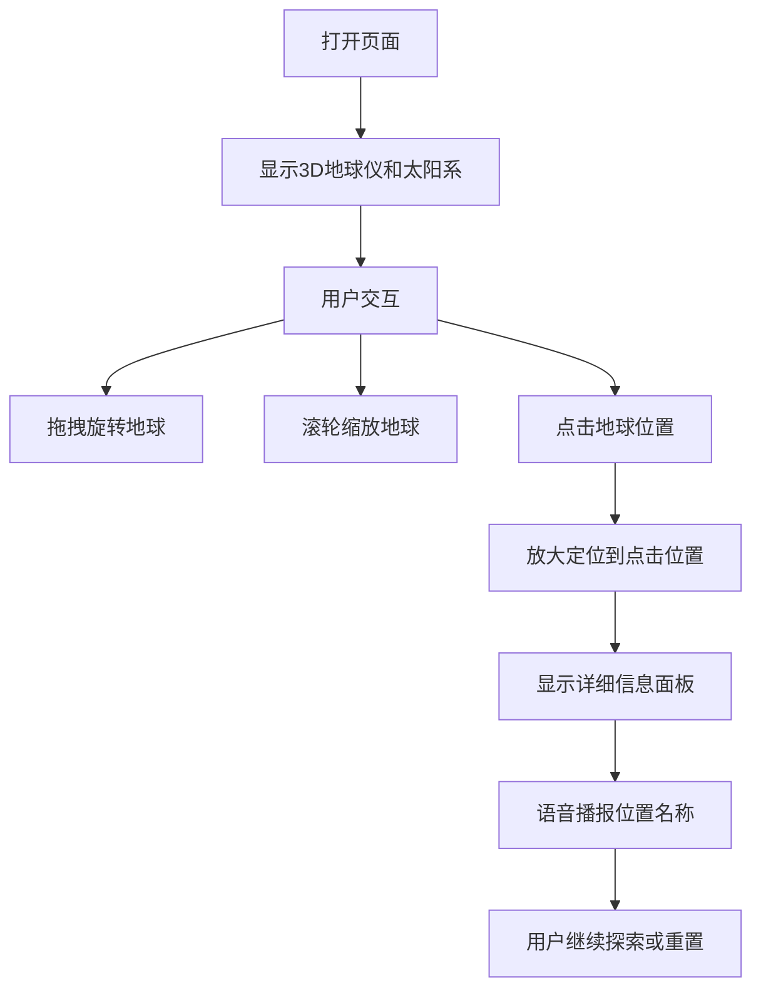

## 1. 产品概述
3D地球仪H5页面，提供交互式3D地球浏览体验，支持点击定位、缩放、旋转，展示太阳系行星、地标信息及语音播报。
- 主要目的：为用户提供沉浸式的地球探索体验，可在手机和桌面端使用
- 目标用户：地理爱好者、教育工作者、普通用户
- 产品价值：将抽象的地理知识可视化，让地球探索变得生动有趣

## 2. 核心功能

### 2.1 功能模块
1. **主页面**: 3D地球场景、太阳系行星展示、地标信息面板

### 2.2 页面详情
| 页面名称 | 模块名称 | 功能描述 |
|-----------|-------------|---------------------|
| 主页面 | 3D地球仪 | 可旋转、缩放的真实地球模型，显示大陆、海洋 |
| 主页面 | 点击定位 | 点击地球任意位置放大定位，显示详细信息 |
| 主页面 | 地标标记 | 显示世界著名地标位置 |
| 主页面 | 语音播报 | 点击位置后自动播报地名信息 |
| 主页面 | 太阳系行星 | 地球周围显示其他行星、月亮、太阳 |
| 主页面 | 信息面板 | 显示当前位置的国家、城市、坐标等信息 |

## 3. 核心流程
用户打开页面，看到3D地球仪和太阳系背景 → 可拖拽旋转地球 → 可滚轮缩放地球 → 点击地球任意位置 → 地球放大定位到点击位置 → 显示该位置的详细信息面板 → 自动语音播报该位置名称 → 用户可继续探索或重置视图

## 4. 用户界面设计

### 4.1 设计风格
- 主色调：深蓝色（太空背景）、白色（星星）、蓝色（海洋）、绿色/棕色（陆地）
- 按钮风格：透明背景，圆角，发光效果
- 字体：系统默认字体，响应式大小
- 布局风格：全屏3D场景，信息面板悬浮显示
- 图标风格：简洁线条图标

### 4.2 页面设计概览
| 页面名称 | 模块名称 | UI元素 |
|-----------|-------------|----------|
| 主页面 | 3D地球场景 | 深蓝色星空背景，旋转的地球，闪烁的星星 |
| 主页面 | 太阳系行星 | 太阳（金色发光）、月球（灰色）、其他行星按比例缩放显示 |
| 主页面 | 信息面板 | 半透明黑色背景，白色文字，圆角设计，显示在底部 |
| 主页面 | 控制按钮 | 重置视角按钮，音量控制按钮 |

### 4.3 响应式设计
- 桌面端和移动端均可使用
- 支持触摸操作（拖拽、双指缩放）
- 信息面板在移动端全屏显示，桌面端侧边显示

### 4.4 3D场景指导
- **环境/氛围**：深空背景，星星闪烁，星云效果
- **光照设置**：太阳光源照亮地球，产生昼夜效果
- **相机设置**：透视相机，支持轨道控制
- **交互和动画**：地球自转、行星公转、点击缩放动画
- **后期处理**：光晕效果、泛光
- **性能优化**：使用简化的几何模型，合理的贴图分辨率
