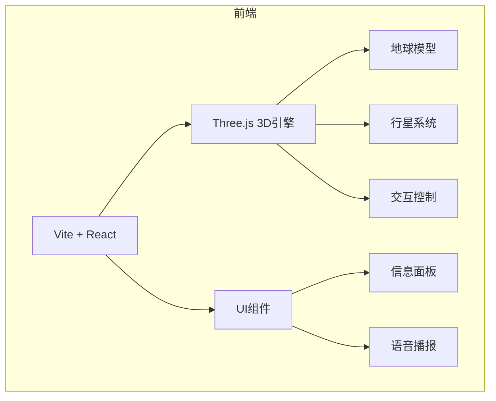

## 1. 架构设计



## 2. 技术说明
- 前端：React@18 + Vite
- 3D引擎：Three.js + @react-three/fiber + @react-three/drei
- 初始化工具：vite-init
- 后端：无（纯前端应用）
- 数据：内置地理数据 + 免费API

## 3. 路由定义
| 路由 | 用途 |
|-------|------|
| / | 主页面 - 3D地球仪场景 |

## 4. 数据模型

### 4.1 地标数据结构
```typescript
interface Landmark {
  id: string;
  name: string;
  nameEn: string;
  type: 'city' | 'mountain' | 'ocean' | 'landmark';
  latitude: number;
  longitude: number;
  description: string;
  altitude?: number;
}
```

### 4.2 行星数据
```typescript
interface Planet {
  name: string;
  nameCn: string;
  radius: number;
  distance: number;
  color: string;
  orbitalPeriod: number;
}
```

## 5. 核心技术方案

### 5.1 3D渲染方案
- 使用Three.js进行3D渲染
- 使用OrbitControls实现相机控制
- 使用Raycaster实现点击检测

### 5.2 地球模型
- 使用球体几何体(SphereGeometry)
- 应用地球纹理贴图
- 添加法线贴图和凹凸贴图增强真实感

### 5.3 坐标转换
- 经纬度坐标转3D坐标
- 使用球面坐标公式

### 5.4 语音播报
- 使用Web Speech API (SpeechSynthesis)
- 支持中英文播报
