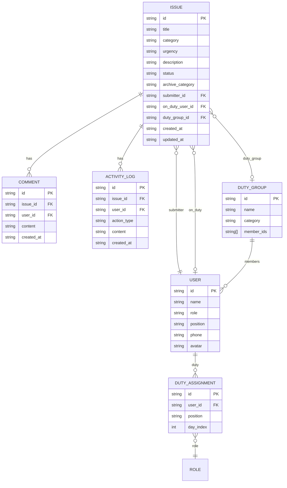

# 运营反馈系统 技术架构文档

## 1. 架构设计

```mermaid
flowchart LR
    "用户浏览器" --> "React 18 SPA"
    "React 18 SPA" --> "React Router 路由层"
    "React Router 路由层" --> "页面组件"
    "页面组件" --> "业务组件"
    "业务组件" --> "Zustand 状态管理"
    "Zustand 状态管理" --> "localStorage 持久化"
    "业务组件" --> "Mock API 服务层"
```

## 2. 技术说明
- 前端：React 18 + TypeScript + Vite
- UI 样式：TailwindCSS 3
- 状态管理：Zustand
- 路由：React Router v6
- 图标：lucide-react
- 日期处理：dayjs
- 表单：React Hook Form + Zod 校验
- 后端：无（Mock 数据 + localStorage 持久化，便于后续接入真实后端）
- 数据库：localStorage（本地持久化）
- 初始化工具：npm create vite@latest

## 3. 路由定义
| 路由 | 用途 |
|------|------|
| `/` | 重定向到 `/issues` |
| `/issues` | 问题列表页（默认首页） |
| `/issues/new` | 问题提交页 |
| `/issues/:id` | 问题详情页 |
| `/duty` | 值班安排页 |
| `/contacts` | 联系人管理页 |

## 4. 数据模型

### 4.1 数据模型定义



### 4.2 TypeScript 类型定义

```ts
export type Urgency = 'normal' | 'urgent';
export type IssueCategory = 'operation' | 'backend' | 'payment' | 'reward';
export type IssueStatus = 'pending' | 'processing' | 'archived';
export type ArchiveCategory =
  | 'history'
  | 'known'
  | 'frontend'
  | 'backend'
  | 'operation'
  | 'non_bug';
export type Position = 'android' | 'ios' | 'frontend' | 'server' | 'tester';
export type Role = 'operator' | 'engineer' | 'admin';

export interface User {
  id: string;
  name: string;
  role: Role;
  position?: Position;
  phone?: string;
  avatar?: string;
}

export interface DutyGroup {
  id: string;
  name: string;
  category: IssueCategory;
  memberIds: string[];
}

export interface DutyAssignment {
  id: string;
  userId: string;
  position: Position;
  dayIndex: number; // 轮转顺序
}

export interface Attachment {
  id: string;
  name: string;
  type: 'image' | 'video';
  url: string; // base64 或 Blob URL
}

export interface ActivityLog {
  id: string;
  issueId: string;
  userId: string;
  userName: string;
  action: 'submit' | 'follow' | 'comment' | 'archive' | 'assign' | 'urgent_call';
  content: string;
  createdAt: string;
}

export interface Comment {
  id: string;
  issueId: string;
  userId: string;
  userName: string;
  content: string;
  createdAt: string;
}

export interface Issue {
  id: string;
  title: string;
  description: string;
  category: IssueCategory;
  urgency: Urgency;
  status: IssueStatus;
  archiveCategory?: ArchiveCategory;
  submitterId: string;
  submitterName: string;
  onDutyUserId?: string;
  onDutyUserName?: string;
  dutyGroupId?: string;
  extraContactIds: string[];
  attachments: Attachment[];
  createdAt: string;
  updatedAt: string;
}
```

## 5. 状态管理

使用 Zustand 创建全局 Store：

- `useIssueStore`：问题列表、详情、提交、跟进、归档
- `useContactStore`：用户、值班组、值班人员
- `useDutyStore`：值班安排、当前值班人查询

## 6. 核心算法

### 6.1 值班人员分配算法
- 按岗位（position）对用户分组
- 每组用户按 dayIndex 排序形成值班顺序
- 当前值班人 = `users[dayOfYear % users.length]`
- 保证每个岗位每天至少有一人值班

### 6.2 紧急问题电话通知
- 提交紧急问题后触发 `notifyUrgentCall(issue, user)` 方法
- 前端展示模拟拨号界面（toast + 模态框）
- 预留真实电话接口位置

## 7. 目录结构

```
src/
├── components/         # 通用组件
│   ├── Layout.tsx
│   ├── Sidebar.tsx
│   ├── Header.tsx
│   ├── IssueCard.tsx
│   ├── Timeline.tsx
│   └── Modal.tsx
├── pages/
│   ├── IssueList.tsx
│   ├── IssueNew.tsx
│   ├── IssueDetail.tsx
│   ├── DutySchedule.tsx
│   └── Contacts.tsx
├── store/
│   ├── issueStore.ts
│   ├── contactStore.ts
│   └── dutyStore.ts
├── types/
│   └── index.ts
├── utils/
│   ├── duty.ts
│   ├── storage.ts
│   └── mock.ts
├── App.tsx
├── main.tsx
└── index.css
```

## 8. Mock 数据策略

初始化时注入：
- 42 名技术人员（安卓5、iOS5、前端10、服务端16、测试6）
- 4 个值班组（运营活动、后台、支付相关、奖励下发）
- 10 条示例问题
- 按岗位生成值班顺序
