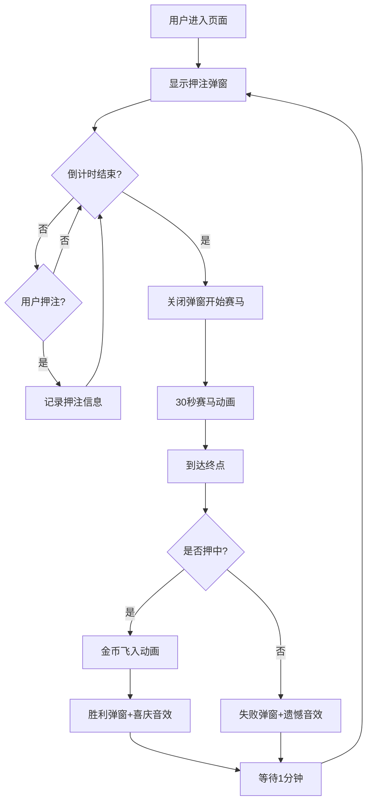

## 1. 产品概述
H5赛马概率抽奖游戏，用户可在赛马开始前押注竞猜哪匹马获胜，通过30秒的赛马动画展示比赛过程，增加趣味性和参与感。
- 主要目的：提供娱乐性的赛马抽奖玩法，用户押注后观看赛马动画获得结果
- 目标用户：喜欢休闲娱乐游戏的H5用户

## 2. 核心功能

### 2.1 用户角色
| 角色 | 注册方式 | 核心权限 |
|------|----------|----------|
| 普通用户 | 直接访问 | 参与押注、观看赛马、查看金币 |

### 2.2 功能模块
1. **赛马主页面**：赛马跑道、赛马动画、终点线效果
2. **押注弹窗**：倒计时、选择马匹、选择押注金额
3. **结算系统**：金币飞入动画、结果弹窗、音效

### 2.3 页面详情
| 页面名称 | 模块名称 | 功能描述 |
|----------|----------|----------|
| 赛马主页面 | 跑道场景 | 横向跑道、两侧广告牌动态后退、起点终点标记 |
| 赛马主页面 | 赛马动画 | 三匹马（白、驼、黑）骨骼动画奔跑、随机速度、平滑减速 |
| 赛马主页面 | 终点效果 | 终点线绳子、第一名撞断绳子 |
| 押注弹窗 | 倒计时 | 显示开始倒计时、自动关闭弹窗 |
| 押注弹窗 | 押注功能 | 选择马匹、选择金额（100/500/自定义） |
| 结算系统 | 金币动画 | 金币飞入右上角、2秒动画 |
| 结算系统 | 结果弹窗 | 胜利/失败弹窗、彩带特效 |
| 结算系统 | 音效系统 | 开始音效、胜利音效、失败音效 |

## 3. 核心流程
用户进入页面 → 显示押注弹窗（倒计时）→ 用户选择马匹和金额押注 → 倒计时结束开始赛马 → 30秒赛马动画 → 到达终点 → 结算（金币飞入+结果弹窗）→ 1分钟后开始下一轮

## 4. 用户界面设计

### 4.1 设计风格
- **主色调**：赛道绿 (#228B22)、天空蓝 (#87CEEB)、金色 (#FFD700)
- **按钮风格**：圆角按钮、渐变效果、悬停放大动画
- **字体**：使用 Google Fonts - Press Start 2P（复古游戏风）作为标题，Roboto 作为正文字体
- **布局风格**：全屏游戏布局、居中跑道、上下装饰区域
- **动画风格**：流畅的骨骼动画、粒子效果、彩带飘动

### 4.2 页面设计概述
| 页面名称 | 模块名称 | UI元素 |
|----------|----------|--------|
| 赛马主页面 | 跑道区域 | 绿色跑道、起点线、终点绳子、广告牌滚动 |
| 赛马主页面 | 马匹 | 白色、驼色、黑色三匹马，骨骼奔跑动画 |
| 押注弹窗 | 弹窗 | 半透明黑色背景、白色卡片、彩虹色按钮 |
| 结算系统 | 金币动画 | 金色硬币、抛物线轨迹、缩放效果 |
| 结算系统 | 结果弹窗 | 彩带飘落、马匹图片、金币数字动画 |

### 4.3 响应式
- 移动端优先设计，适配各种手机屏幕尺寸
- 触摸交互优化，按钮尺寸适合点击
- 横屏竖屏均适配

### 4.4 动画效果
- 马匹奔跑：腿部骨骼动画、身体上下起伏
- 广告牌：向左滚动形成视差效果
- 金币飞入：多枚金币按时间差从左向右飞入
- 彩带：随机颜色、飘落旋转
