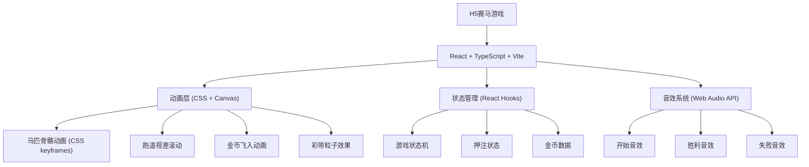
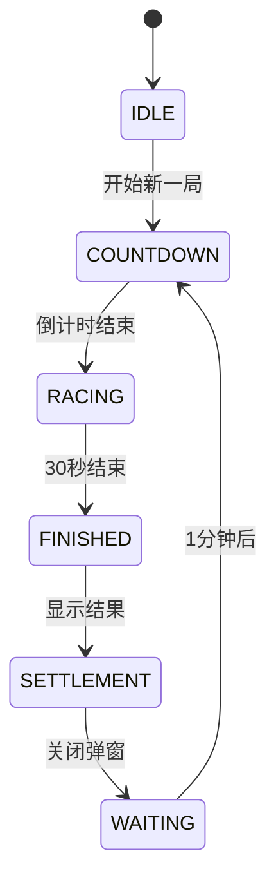

## 1. 架构设计


## 2. 技术描述
- **前端框架**: React@18 + TypeScript + Vite@5
- **样式方案**: TailwindCSS@3 + CSS Modules
- **动画方案**: CSS Keyframes + Canvas API
- **状态管理**: React Hooks (useState, useReducer, useEffect)
- **音效方案**: Web Audio API + 内置音频文件
- **构建工具**: Vite

## 3. 路由定义
| 路由 | 用途 |
|------|------|
| / | 赛马游戏主页面 |

## 4. 核心组件结构
```
src/
├── components/
│   ├── RaceTrack/          # 赛马跑道组件
│   │   ├── Horse.tsx       # 马匹组件（骨骼动画）
│   │   ├── Track.tsx       # 跑道组件
│   │   └── FinishLine.tsx  # 终点线
│   ├── BetModal/           # 押注弹窗
│   │   └── index.tsx
│   ├── ResultModal/        # 结果弹窗
│   │   └── index.tsx
│   ├── CoinRain/           # 金币飞入动画
│   │   └── index.tsx
│   ├── Confetti/           # 彩带效果
│   │   └── index.tsx
│   └── BetButton/          # 押注入口按钮
│       └── index.tsx
├── hooks/
│   ├── useGameState.ts     # 游戏状态管理
│   ├── useAudio.ts         # 音效hook
│   └── useCountdown.ts     # 倒计时hook
├── types/
│   └── index.ts            # 类型定义
├── utils/
│   └── audio.ts            # 音效工具
├── App.tsx
└── main.tsx
```

## 5. 游戏状态机


## 6. 数据模型
### 6.1 类型定义
```typescript
// 马匹类型
interface Horse {
  id: number;
  name: string;
  color: 'white' | 'brown' | 'black';
  position: number;  // 0-100 百分比
  speed: number;     // 当前速度
}

// 押注信息
interface Bet {
  horseId: number;
  amount: number;
}

// 游戏状态
type GamePhase = 'idle' | 'countdown' | 'racing' | 'finished' | 'settlement';
```
