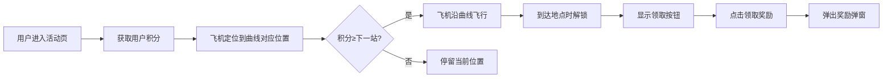

## 1. 产品概述
H5旅行任务活动页面，用户通过累积积分解锁旅行地点，小飞机沿曲线轨迹飞行展示进度
- 主要目的：通过游戏化的旅行轨迹形式激励用户完成任务获取积分，提升用户活跃度
- 目标用户：移动端H5活动参与用户

## 2. 核心功能

### 2.2 功能模块
1. **旅行轨迹主页面**：SVG曲线路径、7个地点节点、飞行的小飞机
2. **积分系统**：显示用户当前积分、各地点对应积分阈值
3. **地点解锁系统**：锁定/解锁状态、高斯模糊效果、解锁动画
4. **奖励领取系统**：领取按钮、奖励弹窗、随机奖励展示

### 2.3 页面详情
| 页面名称 | 模块名称 | 功能描述 |
|-----------|-------------|---------------------|
| 旅行活动页 | 曲线路径模块 | SVG生成自然曲线，7个地点按规则分布在曲线上 |
| 旅行活动页 | 地点节点模块 | 每个地点有城市/景点图，锁定时高斯模糊，解锁后清晰显示 |
| 旅行活动页 | 飞机飞行动画 | 飞机沿曲线飞行，按积分比例定位，到达地点时触发解锁 |
| 旅行活动页 | 积分显示模块 | 顶部显示用户当前积分，每个地点显示对应积分值 |
| 旅行活动页 | 奖励领取模块 | 解锁后出现领取按钮，点击弹出奖励弹窗 |

## 3. 核心流程
用户进入活动页面 → 获取当前积分 → 飞机定位到曲线上对应位置 → 积分达到地点阈值时飞机沿曲线飞行 → 飞机到达地点时解锁该地点（去模糊+开锁动画）→ 点击领取按钮 → 弹出奖励弹窗展示随机奖励

## 4. 用户界面设计
### 4.1 设计风格
- 主色调：天空蓝(#4A90E2) + 活力橙(#FF6B35)
- 辅助色：云朵白(#F8FAFC)、草地绿(#52C41A)
- 按钮风格：圆角渐变按钮，带悬停缩放效果
- 字体：使用圆润友好的无衬线字体
- 整体风格：清新卡通、旅行主题、轻松愉悦

### 4.2 页面设计概述
| 页面名称 | 模块名称 | UI元素 |
|-----------|-------------|-------------|
| 旅行活动页 | 顶部积分栏 | 圆角卡片、积分数字、渐变色 |
| 旅行活动页 | 曲线路径 | 柔和虚线、渐变描边、发光效果 |
| 旅行活动页 | 地点节点 | 圆形图片、锁图标、高斯模糊滤镜 |
| 旅行活动页 | 飞机元素 | 卡通风格、阴影效果、飞行动画 |
| 旅行活动页 | 奖励弹窗 | 毛玻璃背景、庆祝动效、奖励图片 |

### 4.3 响应式
- 移动端优先设计，适配320px-480px宽度
- 垂直滚动布局，支持2屏显示完整轨迹
- 触摸优化，按钮最小尺寸44x44px
