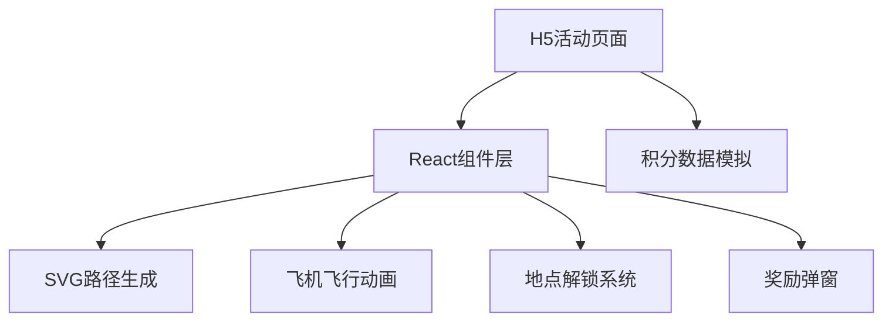

## 1. 架构设计


## 2. 技术选型
- 前端框架：React@18 + TypeScript
- 构建工具：Vite@5
- 样式方案：TailwindCSS@3
- 动画方案：CSS动画 + SVG路径动画
- 图标：Lucide React

## 3. 核心技术实现
### 3.1 曲线路径生成
- 使用贝塞尔曲线生成自然轨迹
- 7个地点坐标：奇数靠右(右20-50px，偶数靠左(左20-80px)
- 垂直间距：每点间隔150-250px随机
- 总高度：约1200-1600px（2屏高度）

### 3.2 飞机沿路径飞行
- 使用SVG path的getPointAtLength()获取路径点
- requestAnimationFrame实现平滑动画
- 积分比例计算当前位置

### 3.3 解锁时机控制
- 精确计算飞机到达地点的精确时刻
- 地点解锁后移除模糊滤镜和锁图标

## 4. 组件结构
```
src/
├── components/
│   ├── TravelMap.tsx      # 主地图组件
│   ├── LocationNode.tsx     # 地点节点组件
│   ├── Airplane.tsx       # 飞机组件
│   ├── ScoreBoard.tsx     # 积分显示组件
│   └── RewardModal.tsx    # 奖励弹窗组件
├── utils/
│   ├── pathGenerator.ts  # 路径生成工具
│   └── animation.ts     # 动画工具
├── data/
│   └── locations.ts     # 地点数据
│   └── rewards.ts       # 奖励数据
├── App.tsx
└── main.tsx
└── index.css
```

## 5. 地点数据结构
```typescript
interface Location {
  id: number;
  name: string;
  image: string;
  points: number;
  x: number;
  y: number;
  unlocked: boolean;
  claimed: boolean;
}
```

## 6. 奖励数据结构
```typescript
interface Reward {
  id: string;
  name: string;
  image: string;
}
```

## 7. 核心算法
1. **路径生成算法**：
   - 生成7个点的坐标
   - 使用Catmull-Rom插值生成平滑曲线
   - 转换为SVG path的d属性

2. **飞机定位算法**：
   - 计算总路径长度
   - 根据积分比例计算当前进度
   - getPointAtLength(progress * totalLength)
   - 计算飞机朝向角度

3. **解锁检测算法**：
   - 飞机位置与各节点距离检测
   - 精确触发解锁动画
