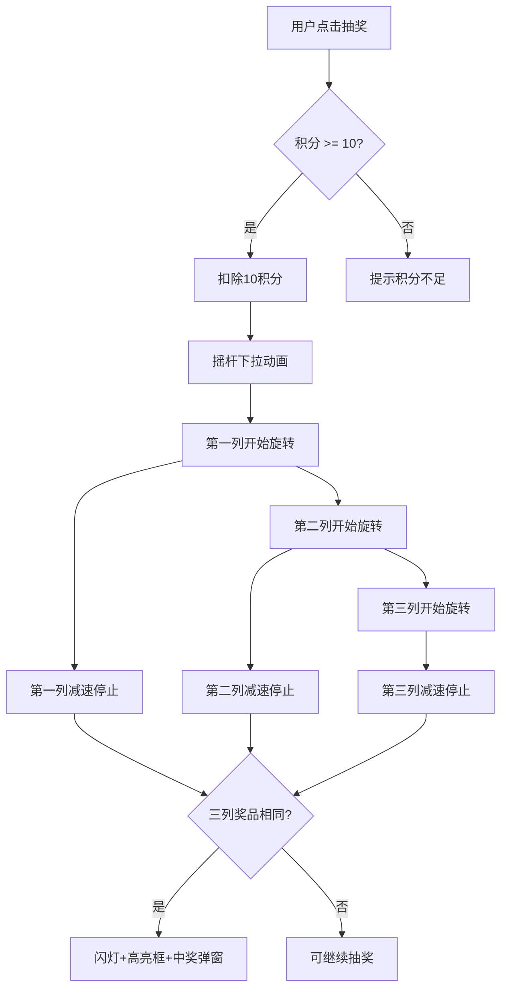

## 1. 产品概述

H5老虎机抽奖玩法页面，用户通过消耗积分进行抽奖，老虎机三列转轮同时旋转并依次停止，三列显示相同奖品即中奖。目标为营销活动场景提供高互动性、视觉冲击力强的抽奖体验。

## 2. 核心功能

### 2.1 用户角色

| 角色 | 注册方式 | 核心权限 |
|------|----------|----------|
| 普通用户 | 无需注册（模拟） | 浏览抽奖页面、消耗积分抽奖、查看中奖记录 |

### 2.2 功能模块

1. **老虎机抽奖页**：老虎机主体、摇杆开关、积分显示、中奖滚动榜

### 2.3 页面详情

| 页面名称 | 模块名称 | 功能描述 |
|----------|----------|----------|
| 老虎机抽奖页 | 积分区域 | 显示当前积分余额，每次抽奖消耗10积分 |
| 老虎机抽奖页 | 老虎机主体 | 三列纵向转轮，每列展示可配置数量的奖品，转动时带加速减速动画 |
| 老虎机抽奖页 | 闪灯效果 | 转动时三列两侧闪灯闪烁，停止后中奖时高亮框框住三列相同奖品 |
| 老虎机抽奖页 | 摇杆开关 | 老虎机右侧摇杆，点击抽奖时摇杆下拉再弹回 |
| 老虎机抽奖页 | 中奖弹窗 | 中奖后弹出恭喜弹窗，展示奖励图片、名称和价值 |
| 老虎机抽奖页 | 中奖滚动榜 | 老虎机下方，多行向上滚动，展示最新10条"恭喜xx获得xx奖励" |

## 3. 核心流程

用户进入页面 → 查看积分余额 → 点击摇杆/抽奖按钮 → 扣除10积分 → 三列依次开始旋转（先加速后减速） → 三列依次停止 → 判定是否中奖：
- 三列相同 → 触发闪灯 + 高亮框 → 弹出中奖弹窗
- 三列不同 → 无特殊效果，可继续抽奖

## 4. 用户界面设计

### 4.1 设计风格

- **主色调**：深红/金色（经典赌场风格），辅以黑色机身
- **按钮样式**：3D立体金色按钮，带光泽渐变
- **字体**：标题使用粗体装饰字体，正文使用简洁无衬线字体
- **布局**：居中纵向布局，老虎机为视觉中心
- **图标**：金币icon用于价值显示，奖品使用图片展示

### 4.2 页面设计概述

| 页面名称 | 模块名称 | UI元素 |
|----------|----------|--------|
| 老虎机抽奖页 | 积分区域 | 金色数字，金币icon，位于老虎机上方 |
| 老虎机抽奖页 | 老虎机主体 | 黑色机身+金色边框，三列转轮居中，奖品纵向排列 |
| 老虎机抽奖页 | 转轮列 | 有价值奖品显示图片+价值+金币icon，无价值配件显示图片+名称 |
| 老虎机抽奖页 | 闪灯 | 三列两侧圆形灯泡，转动时交替闪烁红/黄/绿 |
| 老虎机抽奖页 | 摇杆 | 老虎机右侧，球形把手+金属杆，点击时下拉弹回动画 |
| 老虎机抽奖页 | 中奖高亮框 | 金色发光边框，脉冲动画，框住三列中间行 |
| 老虎机抽奖页 | 中奖弹窗 | 半透明遮罩，居中卡片，展示奖品图片/名称/价值，关闭按钮 |
| 老虎机抽奖页 | 中奖滚动榜 | 老虎机下方，多行向上滚动，渐隐效果 |

### 4.3 响应式设计

- 移动端优先设计（H5页面），适配375px~428px主流手机宽度
- 触摸优化：摇杆和按钮区域足够大，方便点击

### 4.4 奖品展示规则

- **有价值的奖品**（如现金、红包）：显示奖品图片 + 价值金额 + 金币icon，不显示名称
- **无价值的配件**（如贴纸、挂件）：显示奖品图片 + 名称，不显示价值

### 4.5 动画设计

- **转轮旋转**：先加速（0~2圈），后减速（2圈~停止），使用缓动函数
- **列间延迟**：第一列先转，延迟200ms第二列开始，再延迟200ms第三列开始
- **停止顺序**：第一列先停，间隔800ms第二列停，再间隔800ms第三列停
- **闪灯效果**：旋转期间两侧灯泡以200ms间隔交替闪烁
- **中奖高亮**：金色边框从无到有脉冲放大3次后稳定
- **摇杆动画**：把手下拉30°，弹簧回弹，总时长400ms
