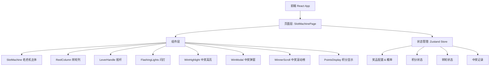

## 1. 架构设计



## 2. 技术说明

- **前端**：React@18 + TypeScript + Tailwind CSS@3 + Vite
- **初始化工具**：vite-init (react-ts 模板)
- **后端**：无（纯前端，模拟数据）
- **状态管理**：Zustand
- **动画**：CSS动画 + requestAnimationFrame 实现转轮滚动

## 3. 路由定义

| 路由 | 用途 |
|------|------|
| / | 老虎机抽奖主页面 |

## 4. 数据模型

### 4.1 奖品配置

```typescript
interface Prize {
  id: string
  name: string
  imageUrl: string
  value: number
  hasValue: boolean
  probability: number
}

interface SlotConfig {
  prizes: Prize[]
  reelItemCount: number
  costPerDraw: number
  initialPoints: number
}
```

### 4.2 默认奖品配置（10个奖品）

| 奖品 | 价值 | 有价值 | 概率 |
|------|------|--------|------|
| 金币x100 | 100 | 是 | 25% |
| 红包x50 | 50 | 是 | 20% |
| 现金x20 | 20 | 是 | 15% |
| 金币x10 | 10 | 是 | 15% |
| 优惠券x5 | 5 | 是 | 10% |
| 贴纸 | 0 | 否 | 5% |
| 挂件 | 0 | 否 | 4% |
| 表情包 | 0 | 否 | 3% |
| 头像框 | 0 | 否 | 2% |
| 大奖-现金x888 | 888 | 是 | 1% |

### 4.3 中奖逻辑

1. 根据各奖品概率，使用加权随机算法确定中奖奖品
2. 将中奖奖品放置在三列的中间行（展示行）
3. 其余位置随机填充其他奖品
4. 每列的奖品顺序独立随机打乱
5. 转轮滚动动画结束后停在预定的中奖位置

### 4.4 中奖用户模拟数据

预设20条模拟中奖记录，每次真实中奖后追加新记录，滚动展示最新10条。

## 5. 关键技术实现

### 5.1 转轮滚动动画

- 使用 `transform: translateY()` 控制转轮偏移
- 通过 `requestAnimationFrame` 驱动动画循环
- 加速阶段：速度从0线性增加到最大速度（2圈）
- 减速阶段：使用缓出函数（easeOutCubic）从最大速度减速到0
- 每列独立动画实例，通过延迟启动实现依次转动效果

### 5.2 概率抽奖算法

```
function drawPrize(prizes: Prize[]): Prize {
  const totalWeight = prizes.reduce((sum, p) => sum + p.probability, 0)
  let random = Math.random() * totalWeight
  for (const prize of prizes) {
    random -= prize.probability
    if (random <= 0) return prize
  }
  return prizes[prizes.length - 1]
}
```

### 5.3 转轮停止位置计算

1. 确定中奖奖品后，计算该奖品在每列中的索引位置
2. 计算需要滚动过的总奖品数 = 整圈数 × 每列奖品数 + 目标索引
3. 三列的整圈数不同以产生依次停止效果
