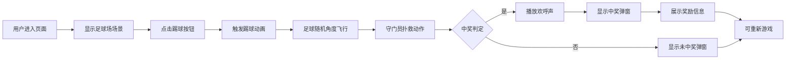

## 1. 产品概述

世界杯主题H5踢球抽奖互动游戏，用户通过点击踢球按钮进行抽奖，以足球射门的形式决定中奖结果，营造沉浸式的足球竞技体验。
- 主要目的：提供趣味化抽奖互动体验，通过足球射门玩法提升用户参与感
- 目标用户：营销活动参与者、足球爱好者、H5互动游戏玩家
- 产品价值：将传统抽奖转化为沉浸式互动体验，提升活动转化率和用户留存

## 2. 核心功能

### 2.1 用户角色
| 角色 | 参与方式 | 核心权限 |
|------|----------|----------|
| 普通用户 | 直接访问H5页面 | 进行踢球抽奖、查看中奖结果 |

### 2.2 功能模块
1. **主游戏页面**：足球场场景、球员、守门员、足球、踢球按钮
2. **动画系统**：球员踢球动画、足球飞行轨迹、守门员扑救动作
3. **抽奖系统**：概率配置、随机角度生成、中奖判定
4. **弹窗系统**：中奖弹窗、未中奖弹窗
5. **音效系统**：进球欢呼声、射门音效

### 2.3 页面详情
| 页面名称 | 模块名称 | 功能描述 |
|-----------|-------------|---------------------|
| 主游戏页面 | 足球场场景 | 球员视角3D足球场，守门员站在球门前等待 |
| 主游戏页面 | 球员角色 | 背对着用户站在罚球点，脚下有足球 |
| 主游戏页面 | 守门员角色 | 标准等待姿势，双手半举，可做出扑救动作 |
| 主游戏页面 | 踢球按钮 | 点击触发踢球动画和抽奖逻辑 |
| 主游戏页面 | 足球动画 | 随机角度射向球门，带有自然弧度 |
| 中奖弹窗 | 奖励展示 | 显示奖励图片、名称、价值（价格+金币icon） |
| 未中奖弹窗 | 提示信息 | 显示遗憾提示，可重新游戏 |

## 3. 核心流程

用户进入页面 → 看到足球场场景和踢球按钮 → 点击踢球按钮 → 球员做出踢球姿势 → 足球以随机角度和弧度飞向球门 → 守门员做出扑救动作 → 根据概率判定是否进球 → 进球显示中奖弹窗（带欢呼声）+ 展示奖励 → 未进球显示遗憾弹窗

## 4. 用户界面设计

### 4.1 设计风格
- **主色调**：足球场绿色 (#1B5E20)、草地绿色渐变、足球白色 (#FFFFFF)、球门白色
- **辅助色**：金色 (#FFD700) 用于中奖高亮、红色 (#E53935) 用于按钮、蓝色 (#1E88E5) 用于球衣
- **按钮风格**：3D立体按钮，圆角设计，带有按压效果
- **字体**：使用富有运动感的字体（如 Bebas Neue 或类似字体），标题大而醒目
- **布局风格**：全屏沉浸式场景，UI元素悬浮在场景之上
- **视觉元素**：草地纹理、球场线条、聚光灯效果、观众席模糊背景

### 4.2 页面设计概述
| 页面名称 | 模块名称 | UI Elements |
|-----------|-------------|-------------|
| 主游戏页面 | 足球场场景 | 透视视角、草地纹理、白色标线、球门框架、守门员居中 |
| 主游戏页面 | 球员角色 | 背视图、球衣号码、短裤、球袜、球鞋 |
| 主游戏页面 | 守门员 | 标准守门姿势、不同颜色球衣、手套 |
| 主游戏页面 | 踢球按钮 | 底部居中、红色渐变、足球图标、"射门"文字 |
| 中奖弹窗 | 弹窗设计 | 金色边框、足球装饰元素、奖杯icon、奖励卡片 |
| 未中奖弹窗 | 弹窗设计 | 灰色调、足球元素、鼓励文字 |

### 4.3 响应式设计
- **移动端优先**：H5主要在手机端访问，优先适配375px宽度
- **自适应布局**：使用vh/vw单位确保在不同屏幕尺寸下场景比例正确
- **触摸优化**：按钮大小适中（≥44px），触摸区域足够大
- **横屏支持**：支持横屏模式，提供更宽阔的视野

### 4.4 动画设计
- **球员踢球**：助跑动作、摆腿动作、跟随动作，关键帧动画
- **足球飞行**：贝塞尔曲线路径、旋转效果、速度变化
- **守门员扑救**：向左右跳跃、扑球动作、落地缓冲
- **弹窗出现**：缩放+淡入动画、轻微弹跳效果
- **按钮交互**：悬停放大、点击缩小、波纹效果

## 5. 抽奖配置说明

| 配置项 | 说明 |
|--------|------|
| 奖励列表 | 可配置多个奖励，每个奖励包含：名称、图片、价值、中奖概率 |
| 未中奖概率 | 可配置未中奖的总概率 |
| 射门角度范围 | 可配置足球射出的角度范围（左右、高低） |
| 射门速度 | 可配置足球飞行的速度 |
| 守门员反应速度 | 可配置守门员扑救的反应时间 |
