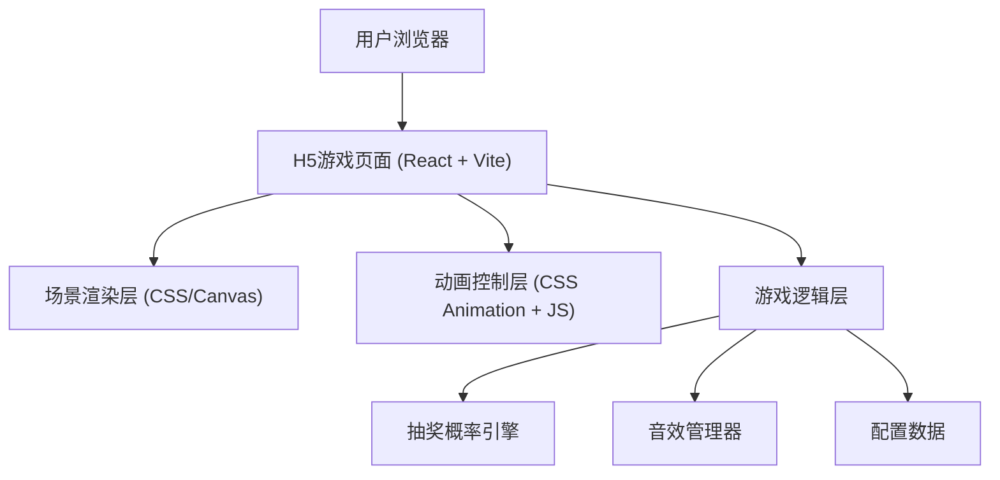

## 1. 架构设计



## 2. 技术描述

- **前端框架**: React@18 + TypeScript
- **构建工具**: Vite@5
- **样式方案**: TailwindCSS@3 + CSS Modules
- **动画方案**: CSS Keyframes + Framer Motion
- **音效方案**: Web Audio API / HTML5 Audio
- **部署**: 纯静态页面，无需后端

## 3. 项目结构

```
src/
├── components/
│   ├── GameScene.tsx        # 游戏主场景
│   ├── FootballField.tsx    # 足球场
│   ├── Player.tsx           # 球员组件
│   ├── Goalkeeper.tsx       # 守门员组件
│   ├── Football.tsx         # 足球组件
│   ├── KickButton.tsx       # 踢球按钮
│   ├── WinModal.tsx         # 中奖弹窗
│   └── LoseModal.tsx        # 未中奖弹窗
├── hooks/
│   └── useGameLogic.ts      # 游戏逻辑Hook
├── config/
│   └── prizes.ts            # 奖励配置
├── utils/
│   ├── probability.ts       # 概率计算工具
│   └── animation.ts         # 动画工具函数
├── assets/
│   ├── sounds/              # 音效文件
│   └── images/              # 图片资源
├── App.tsx
├── main.tsx
└── index.css
```

## 4. 核心数据类型定义

```typescript
// 奖励配置
interface Prize {
  id: string;
  name: string;
  image: string;
  value?: number;  // 价值（可选）
  probability: number;  // 中奖概率 0-1
}

// 游戏状态
type GameState = 'idle' | 'kicking' | 'ballFlying' | 'result';

// 射门结果
interface ShootResult {
  isWin: boolean;
  prize?: Prize;
  angle: {
    horizontal: number;  // 水平角度 -1 到 1
    vertical: number;    // 垂直角度 0 到 1
  };
  speed: number;
  goalkeeperSave: boolean;  // 守门员是否扑到
}

// 游戏配置
interface GameConfig {
  prizes: Prize[];
  loseProbability: number;  // 未中奖概率
  shootSpeed: number;
  goalkeeperReactionTime: number;
}
```

## 5. 核心组件说明

### 5.1 GameScene 主场景
- 管理整个游戏状态
- 协调各子组件动画
- 处理游戏流程控制

### 5.2 FootballField 足球场
- 使用CSS 3D变换创建透视效果
- 渲染草地、球门、标线等元素

### 5.3 Player 球员
- 背视角球员SVG/CSS绘制
- 踢球关键帧动画

### 5.4 Goalkeeper 守门员
- 等待姿势渲染
- 左右扑救动画
- 接球动作

### 5.5 Football 足球
- 贝塞尔曲线飞行动画
- 旋转效果
- 碰撞检测逻辑

### 5.6 WinModal/LoseModal 弹窗
- 中奖/未中奖展示
- 奖励信息展示
- 重新游戏按钮

## 6. 抽奖算法

```typescript
// 概率抽奖算法
function lottery(prizes: Prize[], loseProbability: number): Prize | null {
  const random = Math.random();
  let cumulative = 0;
  
  // 先判断是否未中奖
  if (random < loseProbability) {
    return null;
  }
  
  // 调整中奖概率的总和为1
  const winProbability = 1 - loseProbability;
  const adjustedPrizes = prizes.map(p => ({
    ...p,
    probability: p.probability / winProbability
  }));
  
  // 在中奖池中抽取
  for (const prize of adjustedPrizes) {
    cumulative += prize.probability;
    if (random < loseProbability + cumulative * winProbability) {
      return prize;
    }
  }
  
  return null;
}
```

## 7. 动画实现方案

### 7.1 足球飞行
- 使用CSS `@keyframes` 结合 `cubic-bezier` 缓动
- 水平方向：`translateX` 根据随机角度
- 垂直方向：`translateY` 实现抛物线
- 旋转：`rotateX` / `rotateY` 实现球的旋转

### 7.2 守门员扑救
- 根据射门角度决定扑救方向
- 使用CSS transform实现跳跃和伸展
- 时序控制：球飞出后延迟启动扑救动画

### 7.3 球员踢球
- 助跑：轻微向前移动
- 摆腿：腿部旋转动画
- 跟随：身体倾斜效果

## 8. 性能优化

- 使用CSS硬件加速（transform、opacity）
- 避免布局抖动（Layout Thrashing）
- 动画使用 `will-change` 提示浏览器优化
- 音效预加载
- 图片资源压缩和懒加载
