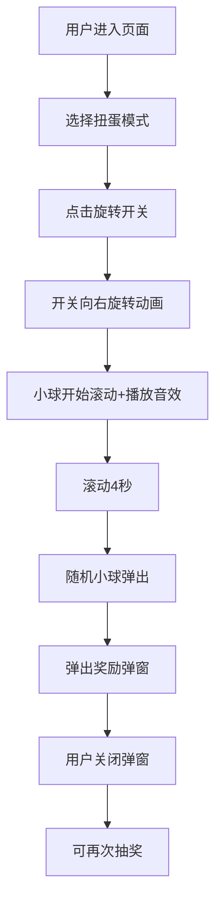

## 1. 产品概述

扭蛋机抽奖H5页面，为用户提供万圣节主题的互动抽奖体验。用户通过点击旋转开关启动扭蛋机，获得随机奖励，支持初级和高级两种玩法模式。

- 主要目的：提供趣味性的抽奖互动体验，增加用户粘性
- 目标用户：喜欢互动抽奖、节日主题活动的用户
- 产品价值：通过精美的视觉效果和流畅的动画体验，打造沉浸式抽奖氛围

## 2. 核心功能

### 2.1 用户角色

| 角色 | 注册方式 | 核心权限 |
|------|----------|----------|
| 普通用户 | 无需注册 | 体验扭蛋机抽奖功能 |

### 2.2 功能模块

1. **扭蛋机主页面**：扭蛋机展示、模式切换按钮、旋转开关、奖励弹窗
2. **扭蛋动画模块**：小球滚动动画、开关旋转动画、出球动画
3. **音效模块**：扭动音效、出球音效
4. **奖励系统模块**：初级奖励池、高级奖励池、随机抽选逻辑

### 2.3 页面详情

| 页面名称 | 模块名称 | 功能描述 |
|---------|----------|----------|
| 扭蛋机主页 | 模式切换区 | 初级扭蛋/高级扭蛋按钮，切换不同玩法风格 |
| 扭蛋机主页 | 扭蛋机主体 | 万圣节主题扭蛋机造型，包含8个彩色小球 |
| 扭蛋机主页 | 旋转开关 | 点击触发扭蛋机启动，开关向右旋转动画 |
| 扭蛋机主页 | 小球滚动区 | 扭蛋机内部8个小球自然滚动动画，持续4秒 |
| 扭蛋机主页 | 出球口 | 随机小球从底部弹出 |
| 扭蛋机主页 | 奖励弹窗 | 展示获得的奖励图片、名称和恭喜文案 |

## 3. 核心流程

用户进入页面 → 选择扭蛋模式（初级/高级）→ 点击旋转开关 → 开关向右旋转 → 扭蛋机内小球开始滚动（伴随音效）→ 滚动4秒后随机一个小球从底部弹出 → 弹出奖励弹窗展示奖励详情 → 用户关闭弹窗可再次抽奖

## 4. 用户界面设计

### 4.1 设计风格

- **主色调**：深紫色 (#2D1B4E)、橙色 (#FF6B35)、南瓜橙 (#FF8C42)
- **辅助色**：怪兽绿 (#4CAF50)、幽灵白 (#F5F5F5)、魔法紫 (#9C27B0)
- **按钮风格**：3D立体按钮，圆角设计，带有万圣节元素浮雕效果
- **字体**：Creepster（万圣节风格标题字体）+ Noto Sans SC（正文字体）
- **布局风格**：居中卡片式布局，扭蛋机为视觉中心
- **装饰元素**：南瓜灯、小怪兽、幽灵、蝙蝠、蜘蛛网等万圣节元素
- **高级模式特效**：金色边框、发光效果、闪烁星星、更华丽的动画

### 4.2 页面设计概述

| 页面名称 | 模块名称 | UI元素 |
|---------|----------|--------|
| 扭蛋机主页 | 背景 | 深紫色渐变背景，散布南瓜、怪兽、幽灵装饰图案 |
| 扭蛋机主页 | 模式切换按钮 | 顶部左右两个按钮，选中状态有高亮发光效果 |
| 扭蛋机主页 | 扭蛋机主体 | 透明玻璃罩可见内部小球，机身有万圣节装饰 |
| 扭蛋机主页 | 旋转开关 | 右侧红色旋钮，点击有旋转动画 |
| 扭蛋机主页 | 小球 | 8个不同颜色的圆形小球，大小一致 |
| 扭蛋机主页 | 出球口 | 扭蛋机底部开口，带装饰边框 |
| 扭蛋机主页 | 奖励弹窗 | 半透明黑色蒙层，圆角卡片，展示奖励图和名称 |

### 4.3 响应式

- 采用移动端优先设计，适配H5页面
- 主要适配375px、414px等主流手机尺寸
- 触摸交互优化，按钮点击区域足够大
- 自适应横竖屏切换

### 4.4 动画效果

- **开关旋转**：点击后向右旋转360度，带回弹效果
- **小球滚动**：物理模拟的随机运动，碰撞效果，持续4秒
- **出球动画**：小球从底部弹出，带弹跳效果
- **弹窗出现**：缩放+淡入动画
- **高级模式**：扭蛋机发光、小球闪烁、粒子特效
