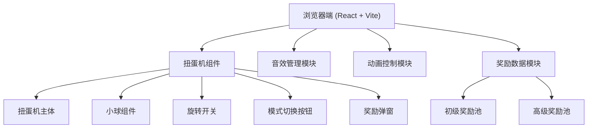

## 1. 架构设计



## 2. 技术描述

- **前端框架**: React@18 + TypeScript + Vite@5
- **样式方案**: TailwindCSS@3 + CSS Animations
- **音效处理**: Web Audio API (原生，无需额外库)
- **动画方案**: CSS Keyframes + requestAnimationFrame 实现物理运动
- **图标方案**: 使用 emoji 和 SVG 绘制万圣节元素
- **数据**: 前端 Mock 数据，无需后端

## 3. 目录结构

```
src/
├── components/
│   ├── GachaMachine/      # 扭蛋机主组件
│   │   ├── index.tsx      # 扭蛋机主体
│   │   ├── Ball.tsx       # 小球组件
│   │   ├── Switch.tsx     # 旋转开关
│   │   └── RewardModal.tsx # 奖励弹窗
│   └── ModeToggle.tsx     # 模式切换按钮
├── hooks/
│   ├── useAudio.ts        # 音效管理Hook
│   └── useAnimation.ts    # 动画控制Hook
├── data/
│   └── rewards.ts         # 奖励数据配置
├── types/
│   └── index.ts           # 类型定义
├── App.tsx                # 主应用入口
├── main.tsx               # React入口
└── index.css              # 全局样式
```

## 4. 核心数据定义

### 4.1 奖励类型定义

```typescript
interface Reward {
  id: string;
  name: string;
  image: string;
  rarity: 'common' | 'rare' | 'epic' | 'legendary';
  color: string;
}

type GameMode = 'normal' | 'premium';

interface BallState {
  id: number;
  x: number;
  y: number;
  vx: number;
  vy: number;
  color: string;
  reward: Reward;
}
```

### 4.2 奖励池配置

**初级奖励池**:
- 普通奖励: 小糖果、贴纸、小玩具
- 稀有奖励: 万圣节面具、南瓜灯
- 史诗奖励: 怪兽玩偶

**高级奖励池**:
- 稀有奖励: 限量徽章、魔法水晶
- 史诗奖励: 黄金南瓜、神秘宝盒
- 传说奖励: 限定手办、超级大奖

## 5. 关键技术实现

### 5.1 小球物理运动模拟

使用 `requestAnimationFrame` 实现帧动画，模拟小球在扭蛋机内的物理运动：
- 重力加速度
- 墙壁碰撞检测与反弹
- 小球之间的碰撞检测
- 摩擦力衰减
- 随机扰动模拟扭动效果

### 5.2 音效实现

使用 Web Audio API 生成音效：
- 扭动音效: 低频锯齿波 + 频率调制
- 出球音效: 高频正弦波 + 衰减包络

### 5.3 动画状态管理

```typescript
type AnimationState = 'idle' | 'switching' | 'rolling' | 'dropping' | 'showing';
```

状态流转:
idle → switching (开关旋转) → rolling (小球滚动) → dropping (出球) → showing (显示弹窗) → idle

### 5.4 视觉特效

- 高级模式发光: CSS `box-shadow` + `animation` 实现呼吸灯效果
- 粒子效果: 使用 CSS `::before`/`::after` 伪元素实现星星闪烁
- 3D效果: CSS `transform-style: preserve-3d` + `perspective`
