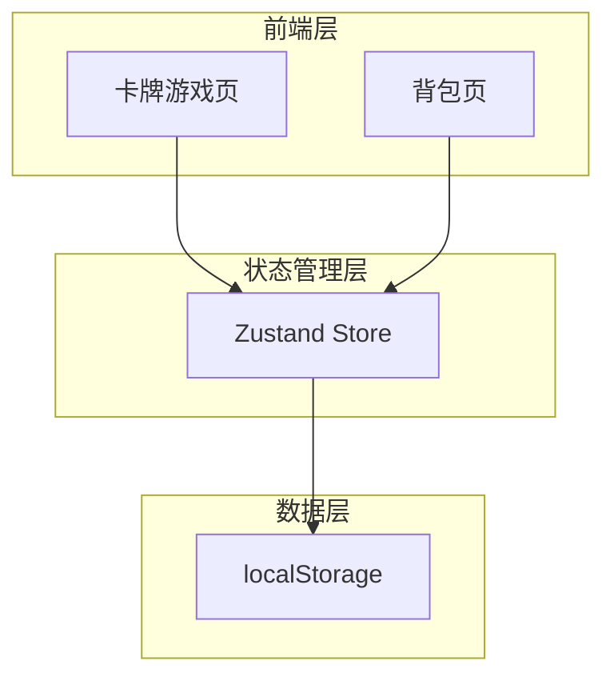
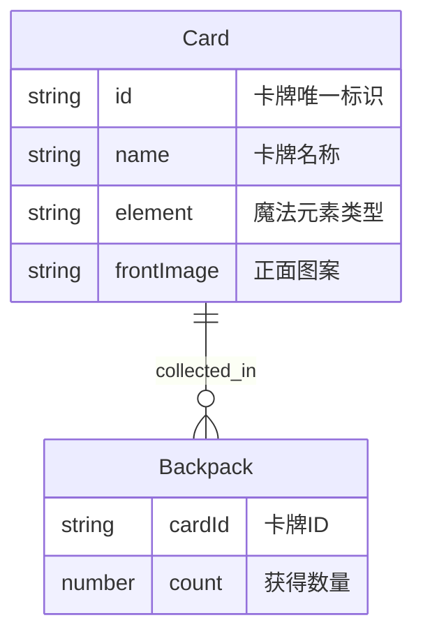

## 1. 架构设计



纯前端架构，无后端服务。使用localStorage持久化卡牌收集数据，Zustand管理全局状态。

## 2. 技术说明
- 前端：React@18 + TypeScript + Tailwind CSS@3 + Vite
- 初始化工具：vite-init
- 后端：无
- 数据库：无（使用localStorage + Zustand持久化）

## 3. 路由定义
| 路由 | 用途 |
|------|------|
| / | 卡牌游戏主页面 |
| /backpack | 背包页面，查看已获得卡牌 |

## 4. API定义
不适用，纯前端项目。

## 5. 服务器架构图
不适用，纯前端项目。

## 6. 数据模型

### 6.1 数据模型定义



### 6.2 卡牌数据定义

6张魔法卡牌定义：
- 火焰之卡（Fire Card）
- 冰霜之卡（Frost Card）
- 雷电之卡（Thunder Card）
- 暗影之卡（Shadow Card）
- 光明之卡（Light Card）
- 自然之卡（Nature Card）

背包数据结构存储于localStorage：
```typescript
interface BackpackItem {
  cardId: string;
  count: number;
}

interface GameState {
  backpack: BackpackItem[];
  hasWonGrandPrize: boolean;
  currentPhase: 'display' | 'flipping' | 'shuffling' | 'selecting' | 'revealed';
}
```
