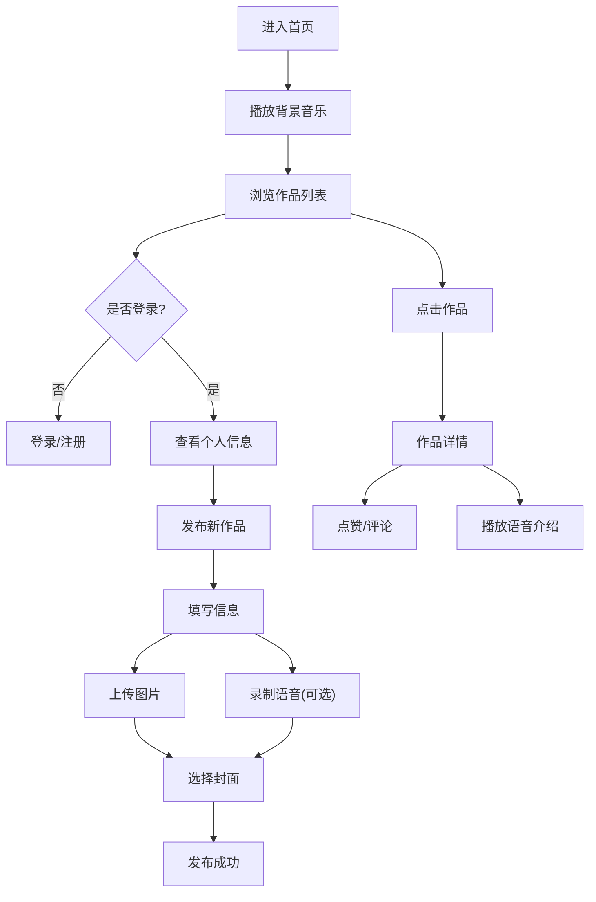

## 1. 产品概述

幼儿园跳槽市场H5展示平台，为幼儿园小朋友和家长提供一个展示和交流二手物品的互动平台，支持发布广告、语音介绍、点赞评论等功能。

- 主要目的：打造一个可爱有趣的幼儿园跳蚤市场线上展示平台
- 目标用户：幼儿园小朋友、家长、管理员
- 产品价值：促进幼儿物品循环利用，增加互动乐趣

## 2. 核心功能

### 2.1 用户角色

| 角色 | 注册方式 | 核心权限 |
|------|----------|----------|
| 普通访客 | 无需注册 | 浏览作品、点赞、留言 |
| 参与人 | 手机号/账号注册 | 发布作品、上传图片、录音、管理自己的作品 |
| 管理员 | 初始化账号(admin1234/root@1234) | 管理用户权限、删除/编辑所有作品、管理用户 |

### 2.2 功能模块

1. **首页**：作品列表展示、响应式布局、背景音乐播放
2. **作品详情页**：完整内容展示、图片轮播、语音播放、评论区
3. **发布作品页**：上传图片(最多9张)、标题、文案、语音录制、选择封面
4. **登录/注册页**：用户身份认证
5. **个人中心**：我的作品、账号信息
6. **管理后台**：用户管理、作品管理

### 2.3 页面详情

| 页面名称 | 模块名称 | 功能描述 |
|----------|----------|----------|
| 首页 | 作品列表 | 响应式网格布局、单个居中/多个平铺、封面图+语音按钮、标题+两行文案 |
| 首页 | 顶部导航 | 背景音乐控制、登录/注册入口、个人中心 |
| 作品详情页 | 内容展示 | 大图展示、完整文案、语音播放按钮 |
| 作品详情页 | 互动区 | 点赞(每人限1次)、评论列表、发表评论 |
| 发布页 | 表单区 | 标题输入、文案编辑、图片上传、语音录制 |
| 管理后台 | 用户管理 | 编辑用户权限、删除用户 |
| 管理后台 | 作品管理 | 编辑/删除任意作品 |

## 3. 核心流程

## 4. 用户界面设计

### 4.1 设计风格

- **主色调**：柔和粉色(#FFB6C1)、天蓝色(#87CEEB)、嫩绿色(#98FB98)
- **按钮风格**：圆角卡通按钮、带有阴影和hover动效
- **字体**：圆润可爱的字体，标题大而醒目
- **布局风格**：卡片式布局，大量圆角和阴影效果
- **图标风格**：卡通emoji风格，使用大量可爱元素(🌟🎈🎨🎪)
- **背景**：渐变色背景+可爱图案装饰

### 4.2 页面设计概述

| 页面名称 | 模块名称 | UI元素 |
|----------|----------|--------|
| 首页 | 作品卡片 | 圆角卡片、阴影效果、封面图、语音播放按钮(悬浮)、文字省略 |
| 首页 | 顶部栏 | 音乐控制按钮、用户头像、可爱标题 |
| 详情页 | 内容区 | 大图片、渐变背景、可爱边框装饰 |
| 发布页 | 表单 | 卡通输入框、图片上传预览区、录音按钮 |

### 4.3 响应式设计

- **移动端优先**：H5页面，适配手机屏幕
- **单作品**：居中展示，宽度占80%
- **多作品**：2列网格布局(手机)、3列布局(平板)
- **触摸优化**：按钮足够大，适合手指点击

### 4.4 特殊效果

- **背景音乐**：进入页面自动播放，可随时暂停/播放
- **语音播放**：封面图悬浮语音按钮，点击播放录音
- **动画效果**：卡片入场动画、点赞动效、弹出层过渡
