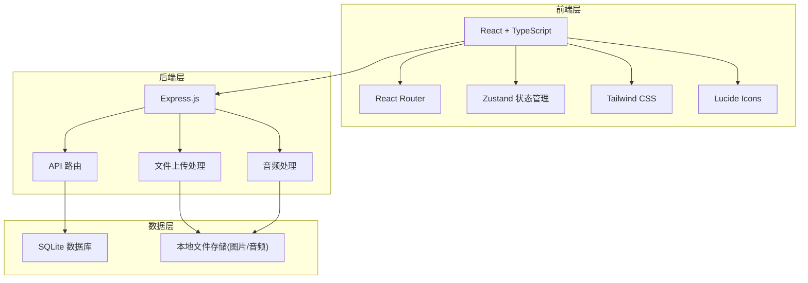
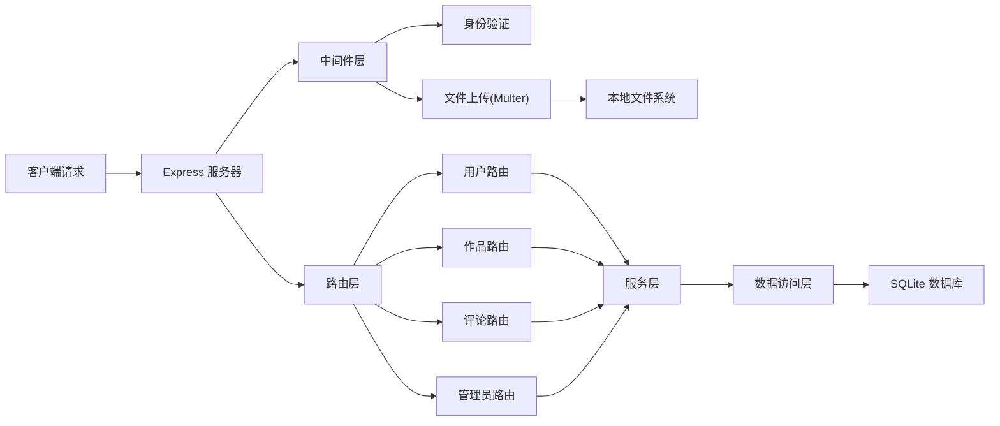
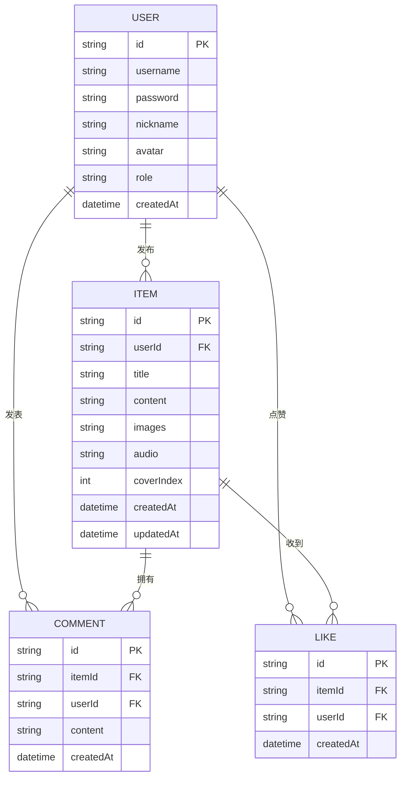

## 1. 架构设计



## 2. 技术描述

- **前端**: React@18 + TypeScript + Vite + TailwindCSS@3 + Zustand + React Router DOM
- **后端**: Express@4 + TypeScript
- **数据库**: SQLite (本地存储，无需额外安装)
- **初始化工具**: vite-init
- **文件上传**: Multer
- **音频录制**: Web Audio API / MediaRecorder API

## 3. 路由定义

| 路由 | 用途 |
|------|------|
| / | 首页 - 作品列表展示 |
| /detail/:id | 作品详情页 |
| /publish | 发布作品页(需登录) |
| /edit/:id | 编辑作品页(需登录) |
| /login | 登录页 |
| /register | 注册页 |
| /profile | 个人中心(需登录) |
| /admin | 管理后台(需管理员权限) |

## 4. API 定义

### 用户相关
```typescript
// 登录
POST /api/auth/login
Request: { username: string, password: string }
Response: { success: boolean, user: User, token: string }

// 注册
POST /api/auth/register
Request: { username: string, password: string, nickname: string }
Response: { success: boolean, user: User }

// 获取用户列表(管理员)
GET /api/admin/users
Response: { users: User[] }

// 更新用户权限(管理员)
PUT /api/admin/users/:id
Request: { role: 'user' | 'admin' }
Response: { success: boolean }

// 删除用户(管理员)
DELETE /api/admin/users/:id
Response: { success: boolean }
```

### 作品相关
```typescript
// 获取作品列表
GET /api/items
Response: { items: Item[] }

// 获取单个作品详情
GET /api/items/:id
Response: { item: Item }

// 创建作品
POST /api/items
Request: FormData (title, content, images[], audio, coverIndex)
Response: { success: boolean, item: Item }

// 更新作品
PUT /api/items/:id
Request: FormData
Response: { success: boolean, item: Item }

// 删除作品
DELETE /api/items/:id
Response: { success: boolean }

// 点赞
POST /api/items/:id/like
Request: { userId: string }
Response: { success: boolean, liked: boolean, likeCount: number }
```

### 评论相关
```typescript
// 获取作品评论
GET /api/items/:id/comments
Response: { comments: Comment[] }

// 发表评论
POST /api/items/:id/comments
Request: { userId: string, content: string }
Response: { success: boolean, comment: Comment }

// 删除评论
DELETE /api/comments/:id
Response: { success: boolean }
```

## 5. 服务器架构图



## 6. 数据模型

### 6.1 数据模型定义



### 6.2 数据库初始化

```sql
-- 用户表
CREATE TABLE users (
  id TEXT PRIMARY KEY,
  username TEXT UNIQUE NOT NULL,
  password TEXT NOT NULL,
  nickname TEXT NOT NULL,
  avatar TEXT,
  role TEXT DEFAULT 'user',
  created_at DATETIME DEFAULT CURRENT_TIMESTAMP
);

-- 作品表
CREATE TABLE items (
  id TEXT PRIMARY KEY,
  user_id TEXT NOT NULL,
  title TEXT NOT NULL,
  content TEXT,
  images TEXT,
  audio TEXT,
  cover_index INTEGER DEFAULT 0,
  created_at DATETIME DEFAULT CURRENT_TIMESTAMP,
  updated_at DATETIME DEFAULT CURRENT_TIMESTAMP,
  FOREIGN KEY (user_id) REFERENCES users(id)
);

-- 评论表
CREATE TABLE comments (
  id TEXT PRIMARY KEY,
  item_id TEXT NOT NULL,
  user_id TEXT NOT NULL,
  content TEXT NOT NULL,
  created_at DATETIME DEFAULT CURRENT_TIMESTAMP,
  FOREIGN KEY (item_id) REFERENCES items(id),
  FOREIGN KEY (user_id) REFERENCES users(id)
);

-- 点赞表
CREATE TABLE likes (
  id TEXT PRIMARY KEY,
  item_id TEXT NOT NULL,
  user_id TEXT NOT NULL,
  created_at DATETIME DEFAULT CURRENT_TIMESTAMP,
  FOREIGN KEY (item_id) REFERENCES items(id),
  FOREIGN KEY (user_id) REFERENCES users(id),
  UNIQUE(item_id, user_id)
);

-- 初始化管理员账号
INSERT INTO users (id, username, password, nickname, role) 
VALUES ('admin001', 'admin1234', 'root@1234', '超级管理员', 'admin');
```
