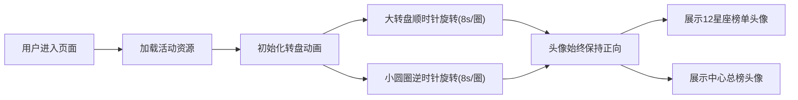

## 1. 产品概述

星座主题H5运营活动页面，以12星座转盘为核心视觉元素，展示用户送礼排行榜，增强用户互动性和付费意愿。通过精美的动画效果和浅紫色梦幻主题，营造神秘浪漫的星座氛围。

- 主要用途：直播/社交平台送礼榜单展示活动
- 目标用户：平台活跃用户、送礼用户
- 核心价值：通过星座主题增强榜单趣味性，激发用户攀比心理和送礼欲望

## 2. 核心功能

### 2.1 用户角色
| 角色 | 参与方式 | 核心权益 |
|------|----------|----------|
| 普通用户 | 浏览活动页面 | 查看榜单、欣赏动画效果 |
| 送礼用户 | 赠送礼物上榜 | 头像展示在对应星座位置 |
| 总榜第一 | 累计送礼金额最高 | 头像展示在转盘中心C位 |

### 2.2 功能模块
1. **活动主页面**：星座转盘展示、总榜中心展示
2. **12星座位**：每个星座对应一个时间周期，展示该周期送礼第一名头像
3. **动态效果**：大转盘缓慢旋转、小圆圈反向旋转保持头像正向

### 2.3 页面详情
| 页面名称 | 模块名称 | 功能描述 |
|-----------|-------------|---------------------|
| 活动主页面 | 大转盘组件 | 直径约700px的圆形转盘，8秒/圈顺时针缓慢旋转 |
| 活动主页面 | 12星座小圆圈 | 均匀分布在转盘边缘，每个带宝座占位符和星座符号 |
| 活动主页面 | 中心头像展示 | 展示累计送礼金额最高用户的头像 |
| 活动主页面 | 装饰元素 | 星光、渐变、光斑等装饰增强视觉效果 |

## 3. 核心流程

用户进入活动页面 → 页面加载完成 → 大转盘开始顺时针缓慢旋转 → 12个小圆圈随转盘移动但保持头像正向 → 中心展示总榜第一头像 → 各星座位展示对应周期榜首头像

## 4. 用户界面设计

### 4.1 设计风格
- **主色调**：浅紫色系 `#E8D5FF` → `#D4B8FF` → `#B892FF` 渐变
- **辅助色**：淡粉色 `#FFD1DC`、银白色 `#F5F5FF`、金色 `#FFD700`
- **背景**：浅紫径向渐变，叠加微妙星光纹理
- **字体**：标题使用优雅衬线字体，正文使用圆润无衬线字体
- **按钮/装饰**：圆角设计，柔和阴影，金边点缀
- **图标**：12星座符号使用简约线条风格

### 4.2 页面设计概述
| 页面名称 | 模块名称 | UI元素 |
|-----------|-------------|-------------|
| 活动主页面 | 大转盘 | 浅紫渐变底色、金色边缘装饰、12星座小圆圈均匀分布 |
| 活动主页面 | 小圆圈 | 白色边框、宝座占位符、底部星座符号、上榜后显示圆形头像 |
| 活动主页面 | 中心区域 | 金色边框圆形头像、皇冠装饰、"送礼之王"标签 |
| 活动主页面 | 装饰元素 | 星星闪烁、光斑漂浮、微妙光效 |

### 4.3 响应式
- 设计优先：移动端优先（H5活动）
- 适配范围：320px - 768px 屏幕宽度
- 转盘尺寸：根据屏幕宽度自适应，最大直径700px，最小直径320px
- 触摸优化：禁用页面滚动，确保转盘动画流畅

### 4.4 动画设计
- **大转盘**：`transform: rotate(360deg)` 动画，8秒/圈，线性缓动，无限循环
- **小圆圈**：`transform: rotate(-360deg)` 动画，8秒/圈，线性缓动，无限循环
- **头像**：相对小圆圈反向旋转，确保视觉上保持正向
- **装饰元素**：星星闪烁动画、光晕呼吸效果
