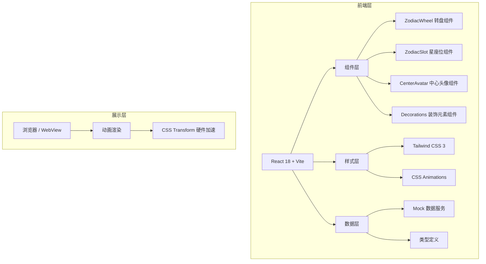

## 1. 架构设计



## 2. 技术描述

- **前端框架**：React@18 + TypeScript
- **构建工具**：Vite@5
- **样式方案**：Tailwind CSS@3 + CSS Variables
- **动画方案**：纯CSS动画（transform + animation），硬件加速
- **数据方案**：Mock数据模拟，无需后端
- **字体方案**：Google Fonts（Noto Serif SC + Noto Sans SC）

## 3. 核心组件设计

| 组件名称 | 文件路径 | 职责描述 |
|----------|----------|----------|
| App | `src/App.tsx` | 主应用入口，页面布局和数据整合 |
| ZodiacWheel | `src/components/ZodiacWheel.tsx` | 大转盘容器，负责旋转动画和12星座位布局 |
| ZodiacSlot | `src/components/ZodiacSlot.tsx` | 单个星座位组件，含宝座占位符、头像、星座符号 |
| CenterAvatar | `src/components/CenterAvatar.tsx` | 中心总榜第一名头像展示 |
| Decorations | `src/components/Decorations.tsx` | 星星、光斑等装饰元素 |

## 4. 类型定义

```typescript
// 星座数据类型
interface ZodiacSign {
  id: number;
  name: string;
  symbol: string;
  dateRange: string;
  startAngle: number;
}

// 用户数据类型
interface User {
  id: string;
  name: string;
  avatar: string;
  amount: number;
}

// 星座榜单类型
interface ZodiacRank {
  zodiacId: number;
  user: User | null;
}

// 活动数据类型
interface ActivityData {
  topUser: User;
  zodiacRanks: ZodiacRank[];
}
```

## 5. 动画实现原理

### 5.1 转盘旋转原理
```
大转盘顺时针旋转: rotate(360deg) 周期8s
小圆圈逆时针旋转: rotate(-360deg) 周期8s
两个旋转速度相同方向相反 → 头像相对静止保持正向
```

### 5.2 12星座位布局计算
```
圆周角度: 360° / 12 = 每个星座间隔30°
半径比例: 小圆圈中心位于大转盘半径的85%位置
起始角度: 从12点钟方向开始（-90°）
位置公式:
  x = centerX + radius * cos(angle)
  y = centerY + radius * sin(angle)
```

### 5.3 CSS 动画关键帧
```css
@keyframes spin-clockwise {
  from { transform: rotate(0deg); }
  to { transform: rotate(360deg); }
}

@keyframes spin-counter {
  from { transform: rotate(0deg); }
  to { transform: rotate(-360deg); }
}

.wheel {
  animation: spin-clockwise 8s linear infinite;
}

.slot-inner {
  animation: spin-counter 8s linear infinite;
}
```

## 6. 12星座配置

| 序号 | 星座 | 符号 | 日期 | 角度位置 |
|------|------|------|------|----------|
| 1 | 白羊座 | ♈ | 3.21-4.19 | 0° |
| 2 | 金牛座 | ♉ | 4.20-5.20 | 30° |
| 3 | 双子座 | ♊ | 5.21-6.21 | 60° |
| 4 | 巨蟹座 | ♋ | 6.22-7.22 | 90° |
| 5 | 狮子座 | ♌ | 7.23-8.22 | 120° |
| 6 | 处女座 | ♍ | 8.23-9.22 | 150° |
| 7 | 天秤座 | ♎ | 9.23-10.23 | 180° |
| 8 | 天蝎座 | ♏ | 10.24-11.22 | 210° |
| 9 | 射手座 | ♐ | 11.23-12.21 | 240° |
| 10 | 摩羯座 | ♑ | 12.22-1.19 | 270° |
| 11 | 水瓶座 | ♒ | 1.20-2.18 | 300° |
| 12 | 双鱼座 | ♓ | 2.19-3.20 | 330° |

## 7. 性能优化策略

1. **硬件加速**：使用 `transform: translateZ(0)` 或 `will-change: transform` 开启GPU加速
2. **减少重绘**：仅使用 transform 和 opacity 属性做动画
3. **图片优化**：头像使用WebP格式，设置适当尺寸
4. **防抖节流**：窗口 resize 事件添加防抖处理
5. **资源预加载**：关键图片资源预加载

## 8. 目录结构

```
src/
├── components/
│   ├── ZodiacWheel.tsx      # 大转盘组件
│   ├── ZodiacSlot.tsx       # 星座位组件
│   ├── CenterAvatar.tsx     # 中心头像组件
│   └── Decorations.tsx      # 装饰元素组件
├── data/
│   ├── zodiac.ts            # 星座配置数据
│   └── mockData.ts          # Mock榜单数据
├── types/
│   └── index.ts             # TypeScript类型定义
├── App.tsx                  # 主应用组件
├── main.tsx                 # 入口文件
└── index.css                # 全局样式和Tailwind配置
```
