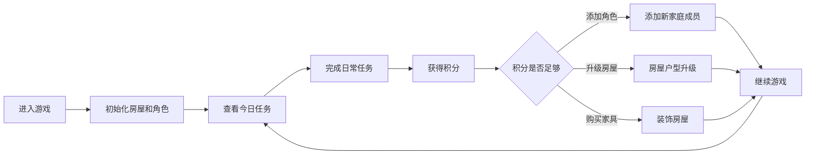

## 1. 产品概述
一款H5养成系生活模拟游戏，玩家可以打造自己的虚拟家园、管理角色日常生活并通过完成任务升级房屋。
- 核心玩法：房屋装饰 + 角色养成 + 日常任务
- 目标用户：喜欢轻松休闲养成类游戏的玩家

## 2. 核心功能

### 2.1 用户角色
| 角色 | 注册方式 | 核心权限 |
|------|----------|----------|
| 玩家 | 本地存储 | 装饰房屋、管理角色、完成任务、升级房屋 |

### 2.2 功能模块
1. **主游戏界面**：房屋全景视图、角色显示、任务面板、积分显示
2. **房屋装饰系统**：户型升级、家具选择、风格定制
3. **角色管理系统**：角色创建、性别选择、多角色管理
4. **日常任务系统**：生物钟日程、手动操作任务、积分奖励
5. **设置系统**：背景音乐控制、游戏设置

### 2.3 页面详情
| 页面名称 | 模块名称 | 功能描述 |
|----------|----------|----------|
| 主游戏页面 | 房屋全景视图 | 2D俯视/等距视角展示房屋布局，支持点击房间切换视角 |
| 主游戏页面 | 角色显示 | 角色在房间内活动，展示日常动作 |
| 主游戏页面 | 任务面板 | 显示当前待完成任务、积分、天数统计 |
| 装饰商店 | 家具选择 | 每类家具至少5种款式选择，预览效果 |
| 装饰商店 | 房屋升级 | 从一室一厅升级到两室一厅、三室一厅 |
| 角色管理 | 角色选择 | 男女各5种风格，支持多角色添加 |
| 日程管理 | 任务定制 | 手动添加/删除日常活动，设置时间和周期 |
| 厨房交互 | 做饭系统 | 选择菜谱、烹饪动作、厨房清洁任务 |
| 洗衣交互 | 洗衣系统 | 30分钟倒计时、完成提醒、晾晒任务 |

## 3. 核心流程

## 4. 用户界面设计

### 4.1 设计风格
- **主色调**：温暖的米白色 (#FAF8F5) 作为背景，柔和的绿色 (#8B9A7D) 作为强调色
- **辅助色**：原木色 (#D4B896)、淡粉色 (#E8D5D0)、天蓝色 (#B8D4E3)
- **按钮风格**：圆润柔和，带有轻微阴影，悬停时有缩放效果
- **字体**：使用圆润可爱的无衬线字体，标题字号24px，正文字号14px
- **布局风格**：卡片式布局，圆角边框，柔和阴影
- **图标风格**：手绘风格emoji，温馨可爱

### 4.2 页面设计概述
| 页面名称 | 模块名称 | UI元素 |
|----------|----------|--------|
| 主游戏页面 | 房屋视图 | 等距视角2D布局、房间分区、家具摆放、角色动画 |
| 主游戏页面 | 底部工具栏 | 任务、装饰、角色、设置四个功能入口 |
| 主游戏页面 | 顶部状态栏 | 日期、天气、积分显示、背景音乐开关 |
| 装饰商店 | 分类面板 | 卧室、客厅、厨房、卫生间分类标签 |
| 装饰商店 | 家具列表 | 横向滚动卡片，显示预览图和价格 |
| 任务面板 | 任务列表 | 待完成任务项，显示图标、名称、奖励积分 |
| 角色管理 | 角色卡片 | 头像预览、性别标签、选择按钮 |

### 4.3 响应式
- 采用移动端优先设计
- 支持横竖屏切换
- 触摸操作优化：按钮最小44x44px
- 适配主流手机屏幕尺寸

### 4.4 2D场景设计
- **视角**：等距视角（45度俯视）
- **房间布局**：清晰的墙体分隔，门和通道合理
- **光照**：柔和的漫射光，营造温馨居家氛围
- **动画**：角色行走动画、家具交互动画、任务完成特效
- **背景音乐**：安静安逸的钢琴曲，循环播放
