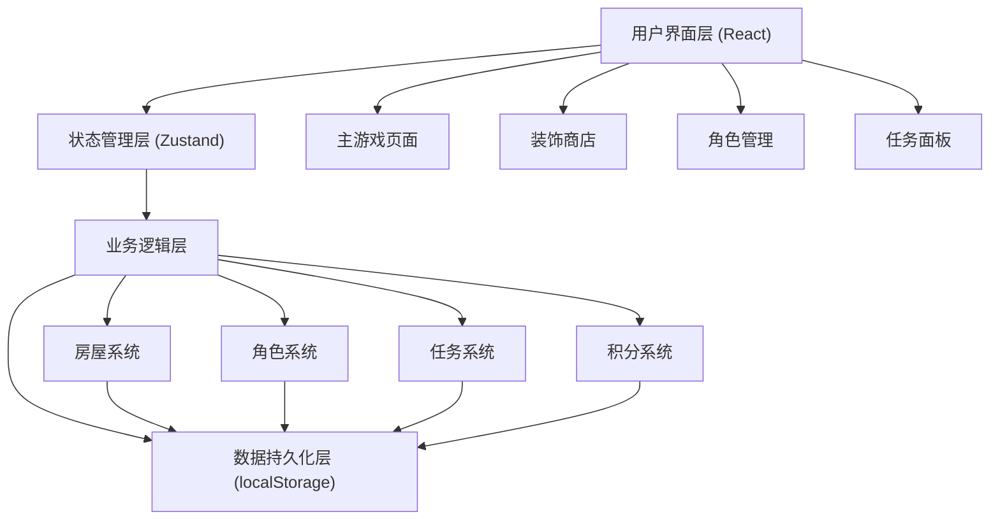
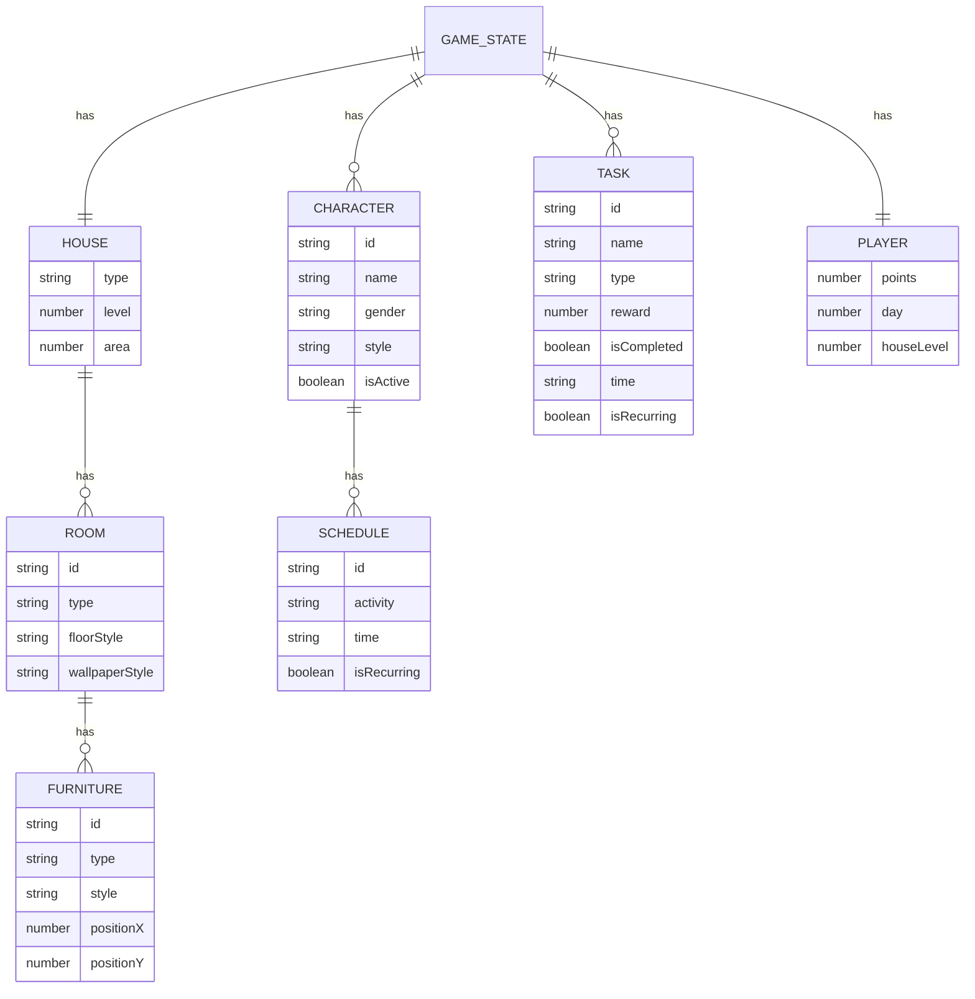

## 1. 架构设计



## 2. 技术描述

- **前端框架**：React@18 + TypeScript + Vite
- **样式方案**：TailwindCSS@3 + CSS Modules
- **状态管理**：Zustand
- **路由**：React Router v6
- **动画**：Framer Motion
- **音频**：Web Audio API
- **数据持久化**：localStorage
- **构建工具**：Vite
- **包管理器**：npm

## 3. 路由定义

| 路由 | 用途 |
|------|------|
| / | 主游戏页面 - 房屋全景视图和游戏主界面 |
| /decorate | 装饰商店 - 家具选择和房屋升级 |
| /characters | 角色管理 - 角色选择和多角色管理 |
| /tasks | 任务面板 - 日常任务列表和日程管理 |
| /kitchen | 厨房交互 - 做饭和清洁系统 |
| /laundry | 洗衣交互 - 洗衣机和晾晒系统 |

## 4. 数据模型

### 4.1 数据模型定义



### 4.2 状态类型定义

```typescript
// 房屋类型
type HouseType = '1room' | '2rooms' | '3rooms';

// 房间类型
type RoomType = 'bedroom' | 'livingroom' | 'kitchen' | 'bathroom';

// 家具类型
type FurnitureType = 'bed' | 'table' | 'chair' | 'sofa' | 'lamp' | 'curtain' | 'floor' | 'wallpaper';

// 角色性别
type Gender = 'male' | 'female';

// 任务类型
type TaskType = 'morning' | 'cooking' | 'cleaning' | 'work' | 'laundry' | 'sleep';

interface Furniture {
  id: string;
  type: FurnitureType;
  style: string;
  name: string;
  price: number;
  emoji: string;
}

interface Character {
  id: string;
  name: string;
  gender: Gender;
  style: string;
  emoji: string;
  isActive: boolean;
  currentRoom: RoomType;
}

interface Task {
  id: string;
  name: string;
  type: TaskType;
  reward: number;
  isCompleted: boolean;
  time: string;
  isRecurring: boolean;
  description: string;
  emoji: string;
}

interface GameState {
  player: {
    points: number;
    day: number;
    totalPoints: number;
  };
  house: {
    type: HouseType;
    level: number;
    area: number;
    rooms: Record<RoomType, RoomState>;
  };
  characters: Character[];
  tasks: Task[];
  musicEnabled: boolean;
  currentView: RoomType | 'overview';
}

interface RoomState {
  floor: string;
  wallpaper: string;
  furniture: Record<FurnitureType, string>;
  cleanliness: number;
}
```

## 5. 核心模块设计

### 5.1 房屋系统
- 支持3种户型：一室一厅、两室一厅、三室一厅
- 每种家具至少5种风格可选
- 房间清洁度动态变化

### 5.2 角色系统
- 男女各5种风格角色
- 支持多角色（最多5人）
- 角色位置和状态管理

### 5.3 任务系统
- 生物钟日程安排
- 手动/自动任务切换
- 积分奖励机制
- 洗衣30分钟倒计时提醒

### 5.4 积分系统
- 每日任务奖励：约100-150积分
- 房屋升级：700积分（7天累计）
- 添加角色：100积分
- 家具购买：20-50积分不等
